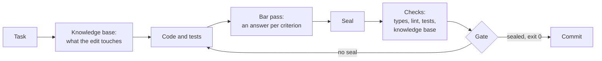

<div align="center">

**English** · [Русский](README.ru.md)

# claudeHarness

<h3>What is held by attention will one day be broken.<br>
What is held by a machine is unbreakable by construction.</h3>

**A working discipline for Claude Code where rules are not asked to be
followed — a machine checks that they are.**


</div>

An AI agent writes code faster than a person. It forgets agreements just as
fast: prompts, instructions, dozens of skills — all of it is text the model
may read, may interpret its own way, and may not carry out. The longer the
rulebook, the more of it rests on attention alone — and the more surely that
attention will one day slip.

**claudeHarness turns this around.** A rule that can be checked is checked by
a machine. The project's knowledge base is reconciled with the code on every
run. Work on code goes through the quality bar criterion by criterion and is
sealed. A commit without the seal is refused, and the agent cannot end its
turn while an edit is not covered by a seal. Even the checks themselves are
not taken on trust: each one is broken on purpose, regularly, to see whether
it notices.

- **Rules → checks.** Over a hundred machine checks instead of hoping for
  diligence.
- **Memory you can trust.** The knowledge base outlives sessions, and a record
  that disagrees with the code fails the run.
- **"Done" means "proven".** Exit code 0, a sealed protocol and a commit
  through the gate — instead of "should work".

## Contents

- [Why](#why)
- [How it works](#how-it-works)
- [What makes it different](#what-makes-it-different)
- [Quick start](#quick-start)
- [What changes in daily work](#what-changes-in-daily-work)
- [What's inside](#whats-inside)
- [How the harness checks itself](#how-the-harness-checks-itself)
- [Requirements and limits](#requirements-and-limits)
- [Status](#status)
- [License](#license)

## Why

Four things that trip up work with an AI agent:

- **A rule in prose holds only while it is remembered.** The model decides
  for itself whether to apply an instruction here and now — and one day it
  does not.
- **Every session starts from a blank page.** What was decided yesterday, and
  why, leaves with the context, and the next session "fixes" what was done on
  purpose.
- **"Done" without proof.** "Tests should pass", "probably works" — these are
  claims, not results.
- **Records drift from the code with no sign.** Notes and docs describe code
  that is no longer there, and read as truth.

## How it works

Every obligation in the harness names what holds it: a check, a gate, a hook
or a test. Where no machine support exists, that is written down plainly, and
a separate summary collects such places: they stay visible instead of being
forgotten.

| What is guaranteed | What holds it |
| --- | --- |
| the knowledge base matches the code | `verify`: a file without a record, a record of a missing file, a shifted anchor, a renamed identifier — the run exits non-zero |
| code is checked against the quality bar | `bar`: a protocol with an answer for every live criterion, and a seal; an edit after the seal removes it |
| unchecked code does not enter history | a pre-commit git hook: code without a seal is refused; bypassing the gate is caught by a guard and a history audit |
| the agent does not drop work halfway | a Claude Code end-of-turn hook: an edit to code without a seal keeps the turn from ending |
| the checks really catch | `falsify`: every check has a recipe that breaks its subject, or a test that does; a check that stays green is itself broken |
| the rulebook does not sprawl | a size budget for the rules: a new rule names what it displaces |



## What makes it different

| A typical agent setup | claudeHarness |
| --- | --- |
| a rule is a paragraph in a prompt or skill; it holds if the model remembers | a rule is held by a machine; where it cannot be, that is written down and shown in a summary |
| "done" because the agent said so | "done" is the full check suite at exit 0 plus a sealed protocol |
| project notes go stale unnoticed | the knowledge base is reconciled with the code on every run, both ways |
| checks are taken on trust | every check is broken on purpose to see whether it turns red |
| more rules make every request more expensive | the rules stay within a budget; history and rationale live apart and are not loaded into every session |

## Quick start

```bash
git clone https://github.com/Igor-lx/claudeHarness.git tmp
cp -r tmp/.claude <your project>/
rm -rf tmp
```

Then, in Claude Code, inside the project:

- **«посади обвязку»** ("seat the harness") — the assistant lays out the
  configs, the knowledge base, the gates and the checks, and runs them,
  following `.claude/seat/seat.md`;
- **«делаем переход»** ("let's transition") — in a project that already has
  code, after seating: the assistant reads all of the code, builds the
  knowledge base and the docs, and records everything where the project
  departs from the rules as debt with a plan. The code itself is not changed.

If the project already has a `.claude` folder, copying does not wipe it: the
harness appends its permissions to your settings file. Check other matching
file names before copying.

## What changes in daily work

- **"Write a function" includes tests** — in the same pass, and each test is
  proven able to fail.
- **The knowledge base is kept as you go**: what a file is responsible for,
  what state it holds, what was done on purpose. The next session reads this
  instead of the whole codebase.
- **Before a commit — a bar pass**: an answer for every quality criterion,
  and a seal.
- **Reports in numbers**: which checks ran and with what exit code, not "all
  good".
- The scope can be narrowed by a direct request ("just a sketch") — and then
  the report says so.

The main commands — all through `node .claude/tools/graph.mjs`:

| Command | What it does |
| --- | --- |
| `verify` | every knowledge-base check against the code at once |
| `brief <path>` | a file's dossier: who uses it, what covers it, what is recorded about it |
| `plan <path>` | what an edit will touch, before it is made: blast radius, tests, records |
| `tested` | an edit against its tests, the knowledge base and the docs |
| `bar` | the pass over the quality bar, and the seal |

## What's inside

| Folder | What it holds |
| --- | --- |
| `rules/` | working rules: the work loop, the quality bar, the knowledge base layout, how prose is written, the environment |
| `tools/` | the `graph.mjs` tool, its reference, the table of checks, the falsification recipes |
| `skills/` | skills: task entry, probes, the bar probe, audit, packaging for handoff |
| `seat/` | seating: the instruction, the map and templates of every project file |
| `hooks/` | the pre-commit gate |
| `state/` | open questions and deferred work on the harness itself |
| `rationale/` | the reasons behind the rules: history, measurements, rejected options |

In detail, with how each part works — [`.claude/README.md`](.claude/README.md)
(in Russian).

## How the harness checks itself

A harness that demands proof has to prove itself too. Four instruments check
it, each with its own question:

| What | Question |
| --- | --- |
| the `falsify` mode | does every check catch its own breakage |
| the `probe` skill | does the harness handle a live task — and what held it |
| the `bar-probe` skill | does the bar pass find a defect planted in the code |
| the `audit` skill | do the rules themselves have gaps, contradictions, or places a machine could hold but prose holds instead |

## Requirements and limits

**Needs:** Node.js 22.23.2 or newer, npm 11 or newer, git, Claude Code. The
default stack is TypeScript, React, Vitest, ESLint and Prettier; the tool
also reads plain JavaScript projects.

**Language:** the rules, skills and tool output are written in Russian.

**What the harness does not promise:**

- it does not judge the product: the checks establish that behaviour is not
  broken and records are true, not whether a design is a good one;
- judgement — is this the right boundary for a module, is it honestly named —
  is held by reading; how well, `bar-probe` measures;
- the last word is yours: any rule gives way to your direct instruction, and
  the report names the bypass.

## Status

Under active development. No releases yet; the design and the rules change
from version to version.

## License

[MIT](LICENSE) — free to use, modify and distribute, provided the copyright
notice is kept.
