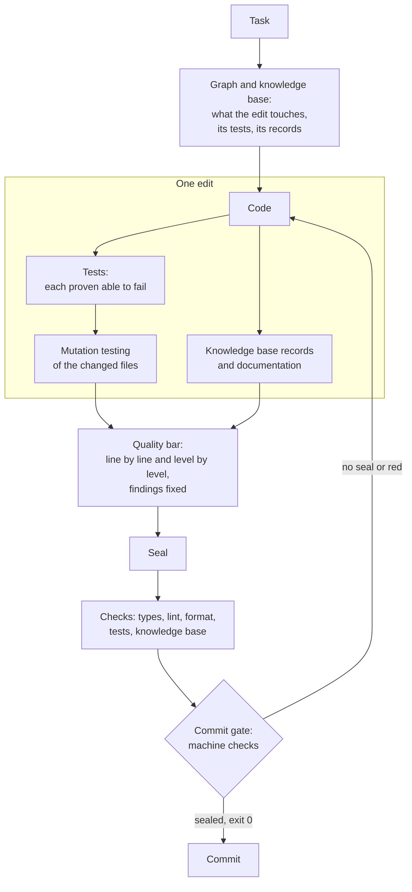
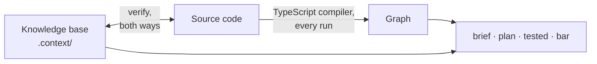

<div align="center">

**English** · [Русский](README.ru.md)

# claudeHarness

**Frontend code quality for Claude Code, held by a machine, not by attention.**

Give the agent a task - get code, tests and documentation proven by machine
checks.<br>Without proof the agent cannot finish its work, and the commit does
not go through.


[How it looks](#how-it-looks) · [Quick start](#quick-start) · [What makes it different](#what-makes-it-different) · [How it works](#how-it-works) · [Installation and setup](#installation-and-setup)

</div>

An AI agent writes code faster than a person. It forgets agreements just as
fast: prompts, instructions, hundreds of skills - all of it is only text, and
text guarantees nothing. The model works in its own inscrutable context - its
own order, scope and direction of reasoning - and the same text gives
different results under different conditions: the model may read only part of
it, forget what it read, shift the emphasis, interpret it in its own way - or
not carry it out at all. The longer the rulebook, the more of it rests on
attention alone - and the more surely that attention will one day slip. What
slips first is quality: a test that cannot fail, a second source of truth, a
boundary crossed "just this once", an error swallowed in silence. The code
works, and nothing shows the defect until it costs.

<h3 align="center">What is held by attention will one day be broken.<br>
What is held by a machine is unbreakable by construction.</h3>

## claudeHarness is not one more of hundreds of skill and rule sets

It is an engineering system for code quality: it turns rules into machine
checks, takes its knowledge of the code from the code itself, and lets nothing
into history that has not been proven. Every edit brings its own tests and
documentation, is checked against the quality bar criterion by criterion -
line by line and level by level, up to the whole application - and is sealed.
A commit without the seal is refused, and the agent cannot end its turn while
an edit is not covered by a seal. So quality depends neither on luck nor on
the history of the session: on every pass the same checks hold it -
predictably and reproducibly. Even the checks themselves are not taken on
trust: each one is broken on purpose, regularly, to see whether it notices.

- **Quality as a checklist, not an impression.** Every edit is checked against
  a named list of criteria, with an answer for each one, and sealed.
- **A rule becomes a check.** Whatever a machine can check, a machine checks;
  where it cannot, the place is recorded and listed in a summary - not left to
  diligence.
- **Checked flat and vertical.** Line by line - and up through the file, the
  layer and the whole application, on facts the tool computes for each level.
  An edit flawless in every line can still break the whole; here that is
  caught.
- **Found means fixed.** A defect noticed along the way is fixed in the same
  pass, as a class - not filed for later.
- **Tests and docs in every edit.** Nobody has to ask for them; each test is
  proven able to fail, and mutation testing measures the rest.
- **Knowledge from the code, not from memory.** A dependency graph rebuilt by
  the compiler on every run, and a knowledge base that fails the run when it
  disagrees with the code.
- **"Done" means "proven".** Exit code 0, a sealed protocol and a pass through
  the commit gate - instead of "should work".
- **Economy by design.** Quality is not bought by rereading the whole
  project on every task: only the area the graph computes is read, the rules
  load when they are needed, and the bar asks only what applies.
- **Made for frontend.** Tuned to React, TypeScript and Vite, on a set of
  package versions it was verified with.

## How it looks

Work usually ends with the agent saying "Done" - and checking the result is
left to you. Here the last word belongs to the machine: the **commit gate**
lets nothing unproven into history, and the **quality bar** is the list of
criteria every edit is checked against.

> 🟠 **agent:** Done, the tests pass.

> 🔵 **commit gate:** The commit will not go through: the work has not been checked against the quality bar.<br>
> 🟣 **quality bar:** I do not accept this pass: a criterion is marked clean, yet a violation of it has already been found.

> 🟠 **agent:** Fixing what was found, adding tests, checking again.

> 🟣 **quality bar:** Accepted: two found, two fixed - setting the seal.<br>
> 🔵 **commit gate:** The seal is there - the commit goes through.

The same pass in the tool's own output - see
[Terminal example](#terminal-example).

## Quick start

1. Clone this repository.
2. Copy the `.claude` folder into the root of your project.
3. Open the project in Claude Code and say: **"seat the harness"**.

From then on - ordinary tasks in plain words. A project with existing code,
the requirements and all the details - in
[Installation and setup](#installation-and-setup).

## What makes it different

| A typical agent setup | claudeHarness |
| --- | --- |
| quality is "looks good to me" | quality is an answer per criterion, with evidence, sealed |
| a rule is a paragraph in a prompt or skill; it holds if the model remembers | a rule is held by a machine; where it cannot be, that is written down and shown in a summary |
| a review reads the lines of the diff | the edit is checked line by line and up through the file, the layer and the whole app - against its neighbours and, for anything new, against the whole project |
| a defect noticed along the way goes into a TODO | a defect noticed along the way is fixed in the same pass, as a class |
| the agent learns the code by guessing - or reads the whole project to be safe | the compiler builds the graph; the area of an edit is computed from it and read in full |
| tests and docs are written when someone asks | tests, records and docs are part of every edit, and a command names what is missing |
| "done" because the agent said so | "done" is the full check suite at exit 0 plus a sealed protocol |
| project notes go stale unnoticed | the knowledge base is reconciled with the code on every run, both ways |
| checks are taken on trust | every check is broken on purpose to see whether it turns red |
| more rules make every request more expensive | the rules stay within a budget; history and rationale live apart and are not loaded into every session |

## How it works

```
RULE  →  CHECK  →  PROOF  →  SEAL  →  COMMIT
```

Every obligation in the harness names what holds it: a check, a gate, a hook
or a test. Where no machine support exists, that is written down plainly, and
a separate summary collects such places - they stay in sight and are not
forgotten.



### Terminal example

The pass from [How it looks](#how-it-looks), shortened; the messages are the
ones the tool prints, translated*:

```
$ git commit
=== Commit gate ===
  COMMIT REFUSED: there is no bar pass at all
  The bar pass is made BEFORE the commit: node .claude/tools/graph.mjs bar

$ node .claude/tools/graph.mjs bar          # an answer per criterion
  holes: 1
    E9: clean, citing another criterion's finding
  No seal. A pass with holes is not a pass.

$ node .claude/tools/graph.mjs bar          # findings fixed, tests added
  seal set: 4df9ed3b9cd2
  findings: 2
    E9 …/RemoveButton.tsx:6 - a double click deletes twice (fixed)
    E3 …/pageSize.ts:2 - external input silently corrected instead of checked (fixed)

$ git commit
  the bar pass covers the edit: commit goes through
```

The agent recorded the double click as a finding under one criterion and
marked `E9`, which names it outright, as clean - and got no seal. Ending the
turn without the seal is not possible either: the end-of-turn hook stops the
agent and names what is missing.

## The commit gate and the quality bar

The commit gate is a machine check before every commit: an edit enters history
only if a sealed pass over the quality bar covers it. The agent runs the check
chain - types, lint, format, tests, the knowledge-base check - before it, and
the end-of-turn hook does not let it finish the work without the seal.

The quality bar is the list every piece of work on code is checked against:
new code, a fix, a refactor, a review. Each criterion is a question to the diff
with a sign you can see, not a principle to agree with. The criteria come from
three places: design principles translated into observable signs; a coverage
map against ISO/IEC 25010 - a map, not a claim of compliance; and cases - a
defect that slipped through adds the sign it should have been caught by.
Sections whose subject a project lacks - network, locales, a CI pipeline -
are declared not applicable, and the bar does not ask them.

Most reviews are flat: they read the lines of the diff. But an edit can be
flawless in every line and still break the whole - add a second source of
truth, give a module a second responsibility, let an internal leak out, import
against the layer direction. None of that shows in the lines; it shows a level
up. So the bar checks every edit in two directions:

- **flat** - every changed line against the line-level criteria: edge inputs,
  errors, types, names, numbers, wasted work;
- **vertical** - up through the levels those lines belong to: the **node** (a
  file, or a component folder), the **layer**, the **whole application**. Each
  level is judged on facts the tool computes for it: the node's surface and
  what the edit changed in it, its state and resources; the edges between
  layers, cycles, entry points bypassed; the sources of truth, the writers of
  each resource, the data flow, the consumers beyond the edit and the test
  that reaches through each.

One criterion's answer does not close another: a finding is marked wherever a
criterion names it, and every level gets its own answer. Anything new is
compared not only with its neighbours but with the whole project: a second
source of truth usually appears where nobody knew about the first one.

## Where the knowledge about the code comes from

A quality judgement is only as good as the facts under it. An agent without
memory learns code by guesswork: it searches, reads a few files and fills in
the rest - or reads everything and pays for it on every task. claudeHarness
gives it two sources, and neither of them is the model's memory.

**The graph - computed, never stored.** `graph.mjs` parses every module of
the project on every run, with the project's own TypeScript compiler, or with
regular expressions when the compiler is not installed. It reads imports and
re-exports, side-effect imports, dynamic `import()`, exports and constants;
resolves the path aliases from `tsconfig.json` and follows links by name
through barrel files. From this it answers what a file uses and who uses it,
the blast radius of an edit, which tests reach a file, cycles, exports nobody
uses and imports that go against the declared layer direction.

**The knowledge base - written, then reconciled.** What cannot be read from a
file itself lives in `.context/`: why something was done this way and what
could be done instead, who owns a piece of state and who writes it, what
breaks if an order changes, which test holds which behaviour, and links the
import graph cannot see - an event-bus topic, a storage key, a CSS variable.
Records are written in forms the tool parses, and `verify` - the last link of
`npm run check` - reconciles them with the code both ways: a record that
disagrees with the code fails the run. Numbers that drift with every edit are
not written at all - a command computes them when they are needed.



## What every edit includes

"Write a function" is not just the function. By default an edit includes:

- **tests, in the same pass**: new code is closed by a test at once, and every
  test that runs changed code proves it can still fail;
- **mutation testing of the changed files**: Stryker breaks the code in every
  place at once, and each surviving mutant gets one of three outcomes - a test
  added, the code fixed, or declared unkillable with a concrete reason;
- **knowledge-base records** in every file the edit concerns, and for the
  neighbours whose description the edit changed;
- **documentation, when a "why" appeared**: a decision record with its options
  and price, the architecture of a layer, the meaning of a setting, the README
  of a component folder;
- **a behaviour guarantee** for a new capability: what the product promises,
  where the promise comes from, and the test that holds it;
- **a quality-bar pass and a seal**: an answer for every live criterion, line
  by line and on every level, and every finding in the area fixed;
- **a report in numbers**: which checks ran and with what exit code.

The scope can be narrowed by a direct request ("just a sketch", "no tests") -
and then the report says so.

| Command (`node .claude/tools/graph.mjs …`) | What it does |
| --- | --- |
| `bar` | the pass over the quality bar, and the seal |
| `brief <path>` | a file's dossier: what it uses, who uses it, what tests reach it, what is recorded about it |
| `plan <path>` | what an edit will touch, before it is made: blast radius, tests, records |
| `tested` | an edit against its tests, the knowledge base and the docs |
| `mutated` | the mutation-testing debt of an edit |
| `verify` | every knowledge-base check against the code at once |

## Economy

Quality through reading everything, every time, is easy and expensive. Here
every read has a reason, and the cost of a task follows its size, not the
size of the project:

- **Reading is bounded by the graph.** The area of an edit - the file, what it
  uses, who uses it, its tests - is read in full; the rest of the code is not
  read. A question about where something lives or what was decided is answered
  by the knowledge base without opening code.
- **Rules arrive when they are needed.** Rules about code load when code is
  opened; the tool reference and the table of checks - on demand; history and
  rationale - only when a rule itself is changed. The size of the rules that
  load is held by a budget in characters, and raising it is a visible change.
- **The machine fills what it can.** Lint, code cuts and checks answer their
  rows of the protocol themselves; the session spends its effort only where
  judgement is needed.

## Stack: built for frontend

The harness was developed for practical work in a specific environment:
frontend applications on **React + TypeScript + Vite**. Its guarantee of
quality rests on that concreteness. A skill that says "write good code" fits
Python, React and Angular alike - because it checks nothing. A rule a machine
checks has to know what it checks: which compiler builds the graph, which
lint rules back each criterion, where a component keeps its styles. So the
effort went into depth rather than breadth: how fully the code is analysed,
how strictly every criterion is checked, how reliably the result reaches its
goal. Seating is tuned to the stack:

- the configs of the compiler, linter, formatter, test runner and mutation
  testing arrive as templates already wired into one check chain,
  `npm run check`;
- the bar is backed by strict tooling: TypeScript in strict mode,
  typescript-eslint strict type-checked, strict React rules, hooks,
  accessibility and SonarJS rule sets; where the harness's setting is stricter
  than the project's, the harness's is set, and the report says so;
- some checks know the stack: class names used in code must exist in the
  component's stylesheet.

**Verified versions.** Seating is tested on a concrete set of versions,
declared in the seed config:

| Area | Packages |
| --- | --- |
| runtime | Node.js 22.23.2, npm 11.0.0 |
| language and build | TypeScript 6.0.3, Vite 8.3.0 |
| UI | React 19.3.0, React DOM 19.3.0, Sass (sass-embedded) 1.89.2 |
| tests | Vitest 4.1.11, jsdom 30.0.1, Testing Library React 16.3.3, Stryker 10.0.0 |
| lint and format | ESLint 10.10.0, @eslint-react 5.24.2, jsx-a11y-x 0.2.0, SonarJS 4.2.2, Prettier 3.9.6 |

On a machine with Node.js or npm below the set, seating stops before its
first change. In a live project nothing is upgraded: seating adds only what is
missing, and packages below the set are named by the run - a notice, not a
failure; whether to upgrade is your call.

**Other stacks.** The graph, the knowledge base, the quality bar and most
checks work on any TypeScript or JavaScript code; the templates and the
stack-specific checks assume React and Vite. Moving the harness to another
stack is not hard: the principles stay the same, only the templates and the
stack-specific checks change. Take the ideas and the tools - an agent will adapt
the rest, seat it and finish it.

## Installation and setup

**Needs:** Node.js 22.23.2 or newer, npm 11 or newer, git and Claude Code.

**1. Copy the harness** into the root of the project:

```bash
git clone https://github.com/Igor-lx/claudeHarness.git tmp
cp -r tmp/.claude <your project>/
rm -rf tmp
```

If the project already has a `.claude` folder, copying does not wipe it: the
harness appends its permissions to your settings file. Check other matching
file names before copying.

**2. Open the project in Claude Code - from its folder.** The environment takes
the harness's permissions, gates and hooks from the folder the session started
in. Started a level above - run `/cd <project>` or restart the session in the
project folder, otherwise they do not apply.

**3. Say "seat the harness".** Following `.claude/seat/seat.md`, the assistant
lays out the configs, the knowledge base, the gates and the checks, adds the
missing check commands and packages to the manifest without touching any
existing version, runs the check chain and reports in numbers. An empty
project gets a scaffold - a small app with a test, so the checks have
something to work on from day one; a project with code gets no scaffold.
Node.js or npm below the verified set stop seating before its first change;
packages below the set are named by the run as a notice - whether to upgrade
is your call.

**4. A project with existing code - "run the transition".** The assistant reads
all of the code, builds the knowledge base, the dependency graph and the
docs, and records everything where the project departs from the rules and the
quality bar as debt with a plan. The code itself is not changed. The debt is
printed by every run and shrinks as work touches its places: what is found
there is fixed in the same pass.

**5. Work.** Tasks in plain words. By default an edit arrives with tests,
knowledge-base records, documentation and a seal; the scope can be narrowed
by a direct request.

**Forks are yours to decide.** Where only a person can decide - a public
contract, product behaviour, the rules themselves - the agent does not decide
for you: it asks, records the question in the knowledge base and names it
first in every report until it is answered.

**Commits are on your command.** The agent does not commit on its own
initiative and does not lift the commit gate even on command: a commit past
the gate is yours to make. Any other rule gives way to your direct
instruction, and the report names the bypass.

## What's inside

| Folder | What it holds |
| --- | --- |
| `rules/` | working rules: the quality bar, the work loop, the knowledge base layout, how prose is written, the environment |
| `tools/` | the `graph.mjs` tool, its reference, the table of checks, the falsification recipes |
| `skills/` | skills: task entry, probes, the bar probe, audit, packaging for handoff |
| `seat/` | seating: the instruction, the map and templates of every project file |
| `hooks/` | the commit gate - a hook before every commit |
| `state/` | open questions and deferred work on the harness itself |
| `rationale/` | the reasons behind the rules: history, measurements, rejected options |

In detail, with how each part works - [`.claude/README.md`](.claude/README.md)
(in Russian).

## How the harness checks itself

A harness that demands proof has to prove itself too. Four instruments check
it, each with its own question:

| What | Question |
| --- | --- |
| the `falsify` mode | does every check catch its own breakage |
| the `probe` skill | does the harness handle a live task - and what held it |
| the `bar-probe` skill | does the quality-bar pass find a defect planted in the code: every criterion has its own plant on the probe stand |
| the `audit` skill | do the rules themselves have gaps, contradictions, or places a machine could hold but prose holds instead |

## Limits

**Language:** the rules, skills and tool output are written in Russian.

**What the harness does not promise:**

- it judges the code, not the product: the checks establish that the code
  meets the bar, behaviour is not broken and records are true - not whether
  the product does what was intended; the coverage map against ISO/IEC 25010
  names which quality characteristics stay outside the bar;
- judgement - is this the right boundary for a module, is it honestly named -
  is held by reading; how well, `bar-probe` measures;
- the last word is yours: the rules give way to your direct instruction, and
  the report names the bypass.

## Status

**Functionally complete; in the tuning phase.** Everything described here is
in place and working: the quality bar and the seal, the graph and the
knowledge base, the gates, seating and the transition, the self-checks. The
architecture and the concept are settled and will not change. Current work is
on how well it all works: tuning, fixing defects and testing - every
criterion of the bar has a planted defect, and probes measure whether the bar
pass catches it. Details of the rules, the checks and the tool's output may
still change between versions.

## License

[MIT](LICENSE) - free to use, modify and distribute, provided the copyright
notice is kept.

---

<sub>* The tool itself speaks Russian: the rules, the skills and every message
are written in Russian.</sub>

<sub>**Keywords:** code quality, quality gates, Claude Code, AI coding agent,
agentic coding, harness, guardrails, prompt engineering, context engineering,
code review, clean code, software architecture, code knowledge base,
dependency graph, mutation testing, test automation, documentation as code,
frontend, React, TypeScript, Vite, Vitest.</sub>
