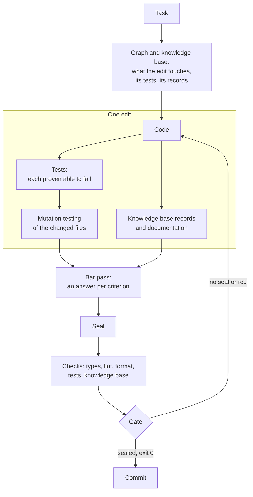
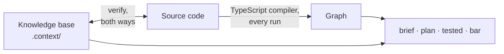

<div align="center">

**English** · [Русский](README.ru.md)

# claudeHarness

<h3>What is held by attention will one day be broken.<br>
What is held by a machine is unbreakable by construction.</h3>

**A working discipline for Claude Code where rules are not asked to be
followed — a machine checks that they are.**


</div>

An AI agent writes code faster than a person. It forgets agreements just as
fast: prompts, instructions, dozens of skills — all of it is text the model
may read, may interpret its own way, and may not carry out. The longer the
rulebook, the more of it rests on attention alone — and the more surely that
attention will one day slip.

**claudeHarness is not one more set of skills and rules. It is an engineering
system** that turns rules into machine checks, takes its knowledge of the code
from the code itself, and lets nothing into history that has not been proven.
Every edit brings its own tests and documentation, goes through the quality
bar criterion by criterion and is sealed. A commit without the seal is
refused, and the agent cannot end its turn while an edit is not covered by a
seal. Even the checks themselves are not taken on trust: each one is broken on
purpose, regularly, to see whether it notices.

- **Rules → checks.** Over a hundred machine checks instead of hoping for
  diligence.
- **Knowledge from the code, not from memory.** A dependency graph rebuilt by
  the compiler on every run, and a knowledge base that fails the run when it
  disagrees with the code.
- **Tests and docs in every edit.** Nobody has to ask for them; each test is
  proven able to fail, and mutation testing measures the rest.
- **"Done" means "proven".** Exit code 0, a sealed protocol and a commit
  through the gate — instead of "should work".
- **Made for frontend.** Tuned to React, TypeScript and Vite, on a set of
  package versions it was verified with.

## Contents

- [Why](#why)
- [How it works](#how-it-works)
- [Where the knowledge about the code comes from](#where-the-knowledge-about-the-code-comes-from)
- [What every edit includes](#what-every-edit-includes)
- [What makes it different](#what-makes-it-different)
- [Stack: built for frontend](#stack-built-for-frontend)
- [Quick start](#quick-start)
- [What's inside](#whats-inside)
- [How the harness checks itself](#how-the-harness-checks-itself)
- [Requirements and limits](#requirements-and-limits)
- [Status](#status)
- [License](#license)

## Why

Four things that trip up work with an AI agent:

- **A rule in prose holds only while it is remembered.** The model decides
  for itself whether to apply an instruction here and now — and one day it
  does not.
- **Every session starts from a blank page.** What was decided yesterday, and
  why, leaves with the context, and the next session "fixes" what was done on
  purpose.
- **"Done" without proof.** "Tests should pass", "probably works" — these are
  claims, not results.
- **Records drift from the code with no sign.** Notes and docs describe code
  that is no longer there, and read as truth.

## How it works

Every obligation in the harness names what holds it: a check, a gate, a hook
or a test. Where no machine support exists, that is written down plainly, and
a separate summary collects such places: they stay visible instead of being
forgotten.

| What is guaranteed | What holds it |
| --- | --- |
| the knowledge base matches the code | `verify`: a file without a record, a record of a missing file, a shifted anchor, a renamed identifier — the run exits non-zero |
| every edit brings its tests | `tested`: each changed code file against the tests that run it; `mutated`: files never measured by mutation testing, or changed since |
| the docs follow the code | `verify`: a dead anchor, a decision nobody references, a path that does not exist, a setting without its explanation; `tested` names the documents of every touched file |
| a promised behaviour stays held | the guarantees table: each promise has a source, the nodes that carry it and a named test; a guarantee whose test is gone fails the run |
| code is checked against the quality bar | `bar`: a protocol with an answer for every live criterion, and a seal; an edit after the seal removes it |
| unchecked code does not enter history | a pre-commit git hook: code without a seal is refused; bypassing the gate is caught by a guard and a history audit |
| the agent does not drop work halfway | a Claude Code end-of-turn hook: an edit to code without a seal keeps the turn from ending |
| the checks really catch | `falsify`: every check has a recipe that breaks its subject, or a test that does; a check that stays green is itself broken |
| the rulebook does not sprawl | a size budget for the rules: a new rule names what it displaces |



## Where the knowledge about the code comes from

An agent without memory learns code by guesswork: it searches, reads a few
files and fills in the rest. claudeHarness gives it two sources, and neither
of them is the model's memory.

**The graph — computed, never stored.** `graph.mjs` parses every module of
the project on every run, with the project's own TypeScript compiler, or with
regular expressions when the compiler is not installed. It reads imports and
re-exports, side-effect imports, dynamic `import()` — template addresses
included — exports and constants; resolves the path aliases declared in
`tsconfig.json`; and follows links by name through barrel files, so a module
that takes everything from a package entry still shows its real dependencies.
From this it answers what a file uses and who uses it, the blast radius of an
edit, which tests reach a file, cycles, exports nobody uses and imports that
go against the declared layer direction.

**The knowledge base — written, then reconciled.** What cannot be read from a
file itself lives in `.context/`: why something was done this way and what
could be done instead, who owns a piece of state and who writes it, what
breaks if an order changes, constraints held in another file, which test holds
which behaviour, and links the import graph cannot see — an event-bus topic, a
storage key, a CSS variable. Records are written in forms the tool parses, and
`verify` reconciles them with the code both ways.

**Why it is always current.** Computed facts are recomputed on every run: no
one wrote them down, so nothing can go stale. Written facts are reconciled by
`verify`, the last link of `npm run check` — the suite every edit ends with: a
record that disagrees with the code fails it. Numbers that drift with every
edit are not written at all — a command computes them when they are needed.



## What every edit includes

"Write a function" is not just the function. By default an edit includes:

- **Tests, in the same pass.** New code is closed by a test at once. Changed
  code makes the agent reopen every test that runs it and prove each one can
  still fail: break the code, see exactly this test turn red, restore. A test
  that cannot fail is a defect of the same edit.
- **Mutation testing of the changed files.** Stryker breaks the code in every
  place at once and shows where no test noticed. Each surviving mutant gets one
  of three outcomes: a test added, the code fixed, or declared unkillable with
  a concrete reason. A ledger keyed by the file's content hash lives in git, and
  `mutated` names files never measured or changed since.
- **Knowledge-base records** in every file the edit concerns — the map, state,
  timing, flows, constraints, decisions, the test registry — and for the
  neighbours whose description the edit changed.
- **Documentation, when a "why" appeared**: a decision record with its options
  and price, the architecture of a layer, the meaning of a setting, the README
  of a component folder. The feature showcase is updated with every behaviour
  visible from outside. Comments are rare and short, and their length is
  checked.
- **A behaviour guarantee** for a new capability: what the product promises,
  where the promise comes from, and the test that holds it.
- **A bar pass and a seal**: an answer for every live quality criterion.
- **A report in numbers**: which checks ran and with what exit code; the
  knowledge base and the docs are confirmed separately.

The scope can be narrowed by a direct request ("just a sketch", "no tests") —
and then the report says so.

The main commands — all through `node .claude/tools/graph.mjs`:

| Command | What it does |
| --- | --- |
| `verify` | every knowledge-base check against the code at once |
| `brief <path>` | a file's dossier: what it uses, who uses it, what tests reach it, what is recorded about it |
| `plan <path>` | what an edit will touch, before it is made: blast radius, tests, records |
| `tested` | an edit against its tests, the knowledge base and the docs |
| `mutated` | the mutation-testing debt of an edit |
| `bar` | the pass over the quality bar, and the seal |

## What makes it different

| A typical agent setup | claudeHarness |
| --- | --- |
| a rule is a paragraph in a prompt or skill; it holds if the model remembers | a rule is held by a machine; where it cannot be, that is written down and shown in a summary |
| the agent learns the code by searching and guessing | the import graph is computed from the code by the compiler; the knowledge base is reconciled with it |
| tests and docs are written when someone asks | tests, records and docs are part of every edit, and a command names what is missing |
| "done" because the agent said so | "done" is the full check suite at exit 0 plus a sealed protocol |
| project notes go stale unnoticed | the knowledge base is reconciled with the code on every run, both ways |
| checks are taken on trust | every check is broken on purpose to see whether it turns red |
| more rules make every request more expensive | the rules stay within a budget; history and rationale live apart and are not loaded into every session |

## Stack: built for frontend

claudeHarness is not a universal kit for any project. It is built for
frontend applications on **React + TypeScript + Vite**, and seating is tuned
to that stack:

- the configs of the compiler, linter, formatter, test runner and mutation
  testing arrive as templates already wired into one check chain,
  `npm run check`;
- where the harness's setting is stricter than the project's — compiler
  strictness, lint rule sets — the harness's is set, and the report says so;
- the project layout is `src/app`, `src/components/<Name>`,
  `src/shared/<area>`, and components are styled with CSS modules in cascade
  layers;
- some checks know the stack: class names used in code must exist in the
  component's stylesheet; React hooks rules and accessibility rules are part of
  the lint;
- an empty project also gets a working app skeleton and the application set:
  routing, state, HTTP, validation, i18n.

**Verified versions.** Seating is tested on a concrete set of versions,
declared in the seed config:

| Area | Packages |
| --- | --- |
| runtime | Node.js 22.23.2, npm 11.0.0 |
| language and build | TypeScript 6.0.3, Vite 8.3.0 |
| UI | React 19.3.0, React DOM 19.3.0, Sass (sass-embedded) 1.89.2 |
| tests | Vitest 4.1.11, jsdom 30.0.1, Testing Library React 16.3.3, Stryker 10.0.0 |
| lint and format | ESLint 10.10.0, @eslint-react 5.24.2, jsx-a11y-x 0.2.0, SonarJS 4.2.2, Prettier 3.9.6 |

On a machine with Node.js or npm below the set, seating stops before its
first change. In a live project nothing is upgraded: seating adds only what is
missing, and packages below the set are named by the run — a notice, not a
failure; whether to upgrade is your call.

**Other stacks.** The graph, the knowledge base and most checks work on any
TypeScript or JavaScript code. The templates, the layout, the styling scheme
and the stack-specific checks assume React and Vite.

## Quick start

```bash
git clone https://github.com/Igor-lx/claudeHarness.git tmp
cp -r tmp/.claude <your project>/
rm -rf tmp
```

Then, in Claude Code, inside the project:

- **«посади обвязку»** ("seat the harness") — the assistant lays out the
  configs, the knowledge base, the gates and the checks, and runs them,
  following `.claude/seat/seat.md`;
- **«делаем переход»** ("let's transition") — in a project that already has
  code, after seating: the assistant reads all of the code, builds the
  knowledge base and the docs, and records everything where the project
  departs from the rules as debt with a plan. The code itself is not changed.

If the project already has a `.claude` folder, copying does not wipe it: the
harness appends its permissions to your settings file. Check other matching
file names before copying.

## What's inside

| Folder | What it holds |
| --- | --- |
| `rules/` | working rules: the work loop, the quality bar, the knowledge base layout, how prose is written, the environment |
| `tools/` | the `graph.mjs` tool, its reference, the table of checks, the falsification recipes |
| `skills/` | skills: task entry, probes, the bar probe, audit, packaging for handoff |
| `seat/` | seating: the instruction, the map and templates of every project file |
| `hooks/` | the pre-commit gate |
| `state/` | open questions and deferred work on the harness itself |
| `rationale/` | the reasons behind the rules: history, measurements, rejected options |

In detail, with how each part works — [`.claude/README.md`](.claude/README.md)
(in Russian).

## How the harness checks itself

A harness that demands proof has to prove itself too. Four instruments check
it, each with its own question:

| What | Question |
| --- | --- |
| the `falsify` mode | does every check catch its own breakage |
| the `probe` skill | does the harness handle a live task — and what held it |
| the `bar-probe` skill | does the bar pass find a defect planted in the code |
| the `audit` skill | do the rules themselves have gaps, contradictions, or places a machine could hold but prose holds instead |

## Requirements and limits

**Needs:** Node.js 22.23.2 or newer, npm 11 or newer, git, Claude Code; the
stack is described in [Stack: built for frontend](#stack-built-for-frontend).

**Language:** the rules, skills and tool output are written in Russian.

**What the harness does not promise:**

- it does not judge the product: the checks establish that behaviour is not
  broken and records are true, not whether a design is a good one;
- judgement — is this the right boundary for a module, is it honestly named —
  is held by reading; how well, `bar-probe` measures;
- the last word is yours: any rule gives way to your direct instruction, and
  the report names the bypass.

## Status

Under active development. No releases yet; the design and the rules change
from version to version.

## License

[MIT](LICENSE) — free to use, modify and distribute, provided the copyright
notice is kept.

---

<sub>**Keywords:** Claude Code, AI coding agent, agentic coding, harness,
guardrails, prompt engineering, context engineering, quality gates, code
knowledge base, dependency graph, mutation testing, test automation,
documentation as code, frontend, React, TypeScript, Vite, Vitest ·
обвязка для Claude Code, промпт-инжиниринг, ИИ-агент, контроль качества кода,
база знаний о коде.</sub>
