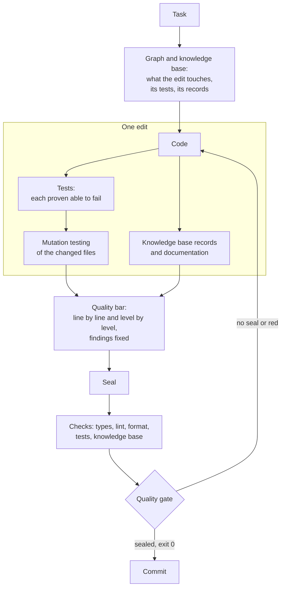
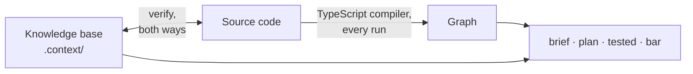

<div align="center">

**English** · [Русский](README.ru.md)

# claudeHarness

<h3>What is held by attention will one day be broken.<br>
What is held by a machine is unbreakable by construction.</h3>

**An engineering system for machine-enforced code quality in Claude Code.**<br>
Rules are not asked to be followed — a machine checks that they are.


</div>

An AI agent writes code faster than a person. It forgets agreements just as
fast: prompts, instructions, hundreds of skills — all of it is only text, and
text guarantees nothing. The model may read only part of it, forget what it
read, shift the emphasis, interpret it in its own way — or not carry it out at
all. The longer the rulebook, the more of it rests on attention alone — and
the more surely that attention will one day slip. What slips first is quality:
a test that cannot fail, a second source of truth, a boundary crossed "just
this once", an error swallowed in silence. The code works, and nothing shows
the defect until it costs.

**claudeHarness is not one more set of skills and rules. It is an engineering
system for code quality**: it turns rules into machine checks, takes its
knowledge of the code from the code itself, and lets nothing into history that
has not been proven. Every edit brings its own tests and documentation, is
checked against the quality bar criterion by criterion — line by line and
level by level, up to the whole application — and is sealed. A commit
without the seal is refused, and the agent cannot end its turn while an edit
is not covered by a seal. Even the checks themselves are not taken on trust:
each one is broken on purpose, regularly, to see whether it notices.

- **Quality as a checklist, not an impression.** Every edit is checked against
  a named list of criteria, with an answer for each one, and sealed.
- **Checked flat and vertical.** Line by line — and up through the file, the
  layer and the whole application, on facts the tool computes for each level.
  An edit flawless in every line can still break the whole; here that is
  caught.
- **Rules → checks.** Whatever a machine can check, a machine checks; where
  it cannot, the place is recorded and listed in a summary — not left to
  diligence.
- **Found means fixed.** A defect noticed along the way is fixed in the same
  pass, as a class — not filed for later.
- **Tests and docs in every edit.** Nobody has to ask for them; each test is
  proven able to fail, and mutation testing measures the rest.
- **Knowledge from the code, not from memory.** A dependency graph rebuilt by
  the compiler on every run, and a knowledge base that fails the run when it
  disagrees with the code.
- **"Done" means "proven".** Exit code 0, a sealed protocol and a commit
  through the quality gate — instead of "should work".
- **Token economy by design.** Quality is not bought by rereading the whole
  project on every task: only the area the graph computes is read, the rules
  load when they are needed, and the bar asks only what applies.
- **Made for frontend.** Tuned to React, TypeScript and Vite, on a set of
  package versions it was verified with.

## Contents

- [Why](#why)
- [What makes it different](#what-makes-it-different)
- [The quality bar](#the-quality-bar)
- [How it works](#how-it-works)
- [Where the knowledge about the code comes from](#where-the-knowledge-about-the-code-comes-from)
- [What it costs in tokens](#what-it-costs-in-tokens)
- [What every edit includes](#what-every-edit-includes)
- [Stack: built for frontend](#stack-built-for-frontend)
- [Quick start](#quick-start)
- [What's inside](#whats-inside)
- [How the harness checks itself](#how-the-harness-checks-itself)
- [Requirements and limits](#requirements-and-limits)
- [Status](#status)
- [License](#license)

## Why

Five things that trip up work with an AI agent — and each of them costs the
code its quality:

- **Quality is judged by impression.** "Looks good" is accepted without
  objection, while an answer per criterion gets checked against the code. The
  same agent writes noticeably different code depending on what it was told
  to check.
- **A rule in prose holds only while it is remembered.** The model decides
  for itself whether to apply an instruction here and now — and one day it
  does not.
- **Every session starts from a blank page.** What was decided yesterday, and
  why, leaves with the context, and the next session "fixes" what was done on
  purpose.
- **"Done" without proof.** "Tests should pass", "probably works" — these are
  claims, not results.
- **Records drift from the code with no sign.** Notes and docs describe code
  that is no longer there, and read as truth.

## What makes it different

| A typical agent setup | claudeHarness |
| --- | --- |
| quality is "looks good to me" | quality is an answer per criterion, with evidence, sealed |
| a review reads the lines of the diff | the edit is checked line by line and up through the file, the layer and the whole app — against its neighbours and, for anything new, against the whole project |
| a defect noticed along the way goes into a TODO | a defect noticed along the way is fixed in the same pass, as a class |
| a rule is a paragraph in a prompt or skill; it holds if the model remembers | a rule is held by a machine; where it cannot be, that is written down and shown in a summary |
| the agent learns the code by searching and guessing | the import graph is computed from the code by the compiler; the knowledge base is reconciled with it |
| the agent reads the whole project to be safe — or a few files and guesses | the area of an edit is computed from the graph and read in full; code outside it is not read |
| tests and docs are written when someone asks | tests, records and docs are part of every edit, and a command names what is missing |
| "done" because the agent said so | "done" is the full check suite at exit 0 plus a sealed protocol |
| project notes go stale unnoticed | the knowledge base is reconciled with the code on every run, both ways |
| checks are taken on trust | every check is broken on purpose to see whether it turns red |
| more rules make every request more expensive | the rules stay within a budget; history and rationale live apart and are not loaded into every session |

## The quality bar

The quality bar is the list every piece of work on code is checked against:
new code, a fix, a refactor, a review. Each criterion is a question to the diff
with a sign you can see, not a principle to agree with. The criteria come from
three places: design principles translated into observable signs; a coverage
map against ISO/IEC 25010 — a map, not a claim of compliance; and cases — a
defect that slipped through adds the sign it should have been caught by.
Sections whose subject a project lacks — network, locales, a CI pipeline —
are declared not applicable, and the bar does not ask them.

### Flat and vertical

Most reviews are flat: they read the lines of the diff. But an edit can be
flawless in every line and still break the whole — add a second source of
truth, give a module a second responsibility, let an internal leak out, import
against the layer direction. None of that shows in the lines; it shows a level
up. So the bar checks every edit in two directions:

- **flat** — every changed line against the line-level criteria: edge inputs,
  errors, types, names, numbers, wasted work;
- **vertical** — up through the levels those lines belong to: the **node** (a
  file, or a component folder), the **layer**, the **whole application**. Each
  level is judged on facts the tool computes for it: the node's surface and
  what the edit changed in it, its state and resources; the edges between
  layers, cycles, entry points bypassed; the sources of truth, the writers of
  each resource, the data flow, the consumers beyond the edit and the test
  that reaches through each.

A good result at one level does not cover a bad one at another: every level
gets its own answer. And anything new is compared not only with its
neighbours but with the whole project: a second source of truth usually
appears where nobody knew about the first one.

## How it works

Every obligation in the harness names what holds it: a check, a gate, a hook
or a test. Where no machine support exists, that is written down plainly, and
a separate summary collects such places: they stay visible instead of being
forgotten.



## Where the knowledge about the code comes from

A quality judgement is only as good as the facts under it. An agent without
memory learns code by guesswork: it searches, reads a few files and fills in
the rest — or reads everything and pays for it on every task. claudeHarness
gives it two sources, and neither of them is the model's memory.

**The graph — computed, never stored.** `graph.mjs` parses every module of
the project on every run, with the project's own TypeScript compiler, or with
regular expressions when the compiler is not installed. It reads imports and
re-exports, side-effect imports, dynamic `import()` — template addresses
included — exports and constants; resolves the path aliases declared in
`tsconfig.json`; and follows links by name through barrel files, so a module
that takes everything from a package entry still shows its real dependencies.
From this it answers what a file uses and who uses it, the blast radius of an
edit, which tests reach a file, cycles, exports nobody uses and imports that
go against the declared layer direction.

**The knowledge base — written, then reconciled.** What cannot be read from a
file itself lives in `.context/`: why something was done this way and what
could be done instead, who owns a piece of state and who writes it, what
breaks if an order changes, constraints held in another file, which test holds
which behaviour, and links the import graph cannot see — an event-bus topic, a
storage key, a CSS variable. Records are written in forms the tool parses, and
`verify` reconciles them with the code both ways.

**Why it is always current.** Computed facts are recomputed on every run: no
one wrote them down, so nothing can go stale. Written facts are reconciled by
`verify`, the last link of `npm run check` — the suite every edit ends with: a
record that disagrees with the code fails it. Numbers that drift with every
edit are not written at all — a command computes them when they are needed.



## What it costs in tokens

Quality through reading everything, every time, is easy and expensive. Here
every read has a reason, and the cost of a task follows its size, not the
size of the project:

- **Reading is bounded by the graph.** The area of an edit — the file, what it
  uses, who uses it, its tests — is read in full; the rest of the code is not
  read. A question about where something lives or what was decided is answered
  by the knowledge base without opening code.
- **Rules arrive when they are needed.** Rules about code load when code is
  opened; the tool reference and the table of checks — on demand; history and
  rationale — only when a rule itself is changed. The size of the rules that
  load is held by a budget in characters, and raising it is a visible change.
- **The bar asks what applies.** Sections without a subject in the project are
  declared not applicable and are not asked.
- **The machine fills what it can.** Lint, code cuts and checks answer their
  rows of the protocol themselves; the session spends its effort only where
  judgement is needed.

## What every edit includes

"Write a function" is not just the function. By default an edit includes:

- **Tests, in the same pass.** New code is closed by a test at once. Changed
  code makes the agent reopen every test that runs it and prove each one can
  still fail: break the code, see exactly this test turn red, restore. A test
  that cannot fail is a defect of the same edit.
- **Mutation testing of the changed files.** Stryker breaks the code in every
  place at once and shows where no test noticed. Each surviving mutant gets one
  of three outcomes: a test added, the code fixed, or declared unkillable with
  a concrete reason. A ledger keyed by the file's content hash lives in git, and
  `mutated` names files never measured or changed since.
- **Knowledge-base records** in every file the edit concerns — the map, state,
  timing, flows, constraints, decisions, the test registry — and for the
  neighbours whose description the edit changed.
- **Documentation, when a "why" appeared**: a decision record with its options
  and price, the architecture of a layer, the meaning of a setting, the README
  of a component folder. The feature showcase is updated with every behaviour
  visible from outside. Comments are rare and short, and their length is
  checked.
- **A behaviour guarantee** for a new capability: what the product promises,
  where the promise comes from, and the test that holds it.
- **A quality-bar pass and a seal**: an answer for every live criterion, line
  by line and on every level, and every finding in the area fixed.
- **A report in numbers**: which checks ran and with what exit code; the
  knowledge base and the docs are confirmed separately.

The scope can be narrowed by a direct request ("just a sketch", "no tests") —
and then the report says so.

The main commands — all through `node .claude/tools/graph.mjs`:

| Command | What it does |
| --- | --- |
| `bar` | the pass over the quality bar, and the seal |
| `brief <path>` | a file's dossier: what it uses, who uses it, what tests reach it, what is recorded about it |
| `plan <path>` | what an edit will touch, before it is made: blast radius, tests, records |
| `tested` | an edit against its tests, the knowledge base and the docs |
| `mutated` | the mutation-testing debt of an edit |
| `verify` | every knowledge-base check against the code at once |

## Stack: built for frontend

The harness was developed for practical work in a specific environment:
frontend applications on **React + TypeScript + Vite**. Its guarantee of
quality rests on that concreteness. A skill that says "write good code" fits
Python, React and Angular alike — because it checks nothing. A rule a machine
checks has to know what it checks: which compiler builds the graph, which
lint rules back each criterion, where a component keeps its styles. So the
effort went into depth rather than breadth: how fully the code is analysed,
how strictly every criterion is checked, how reliably the result reaches its
goal. Seating is tuned to the stack:

- the configs of the compiler, linter, formatter, test runner and mutation
  testing arrive as templates already wired into one check chain,
  `npm run check`;
- the bar is backed by strict tooling: TypeScript in strict mode,
  typescript-eslint strict type-checked, strict React rules, hooks,
  accessibility and SonarJS rule sets; where the harness's setting is stricter
  than the project's, the harness's is set, and the report says so;
- some checks know the stack: class names used in code must exist in the
  component's stylesheet.

**Verified versions.** Seating is tested on a concrete set of versions,
declared in the seed config:

| Area | Packages |
| --- | --- |
| runtime | Node.js 22.23.2, npm 11.0.0 |
| language and build | TypeScript 6.0.3, Vite 8.3.0 |
| UI | React 19.3.0, React DOM 19.3.0, Sass (sass-embedded) 1.89.2 |
| tests | Vitest 4.1.11, jsdom 30.0.1, Testing Library React 16.3.3, Stryker 10.0.0 |
| lint and format | ESLint 10.10.0, @eslint-react 5.24.2, jsx-a11y-x 0.2.0, SonarJS 4.2.2, Prettier 3.9.6 |

On a machine with Node.js or npm below the set, seating stops before its
first change. In a live project nothing is upgraded: seating adds only what is
missing, and packages below the set are named by the run — a notice, not a
failure; whether to upgrade is your call.

**Other stacks.** The graph, the knowledge base, the quality bar and most
checks work on any TypeScript or JavaScript code; the templates and the
stack-specific checks assume React and Vite. Moving the harness to another
stack is not hard: the principles stay the same, only the templates and the
stack-specific checks change. Take the ideas and the tools — an agent will adapt
the rest, seat it and finish it.

## Quick start

```bash
git clone https://github.com/Igor-lx/claudeHarness.git tmp
cp -r tmp/.claude <your project>/
rm -rf tmp
```

Then, in Claude Code, inside the project:

- **"Seat the harness"** — the assistant lays out the configs, the knowledge
  base, the gates and the checks, and runs them, following
  `.claude/seat/seat.md`;
- **"Run the transition"** — in a project that already has code, after
  seating: the assistant reads all of the code, builds the knowledge base and
  the docs, and records everything where the project departs from the rules
  and the quality bar as debt with a plan. The code itself is not changed.

If the project already has a `.claude` folder, copying does not wipe it: the
harness appends its permissions to your settings file. Check other matching
file names before copying.

## What's inside

| Folder | What it holds |
| --- | --- |
| `rules/` | working rules: the quality bar, the work loop, the knowledge base layout, how prose is written, the environment |
| `tools/` | the `graph.mjs` tool, its reference, the table of checks, the falsification recipes |
| `skills/` | skills: task entry, probes, the bar probe, audit, packaging for handoff |
| `seat/` | seating: the instruction, the map and templates of every project file |
| `hooks/` | the pre-commit quality gate |
| `state/` | open questions and deferred work on the harness itself |
| `rationale/` | the reasons behind the rules: history, measurements, rejected options |

In detail, with how each part works — [`.claude/README.md`](.claude/README.md)
(in Russian).

## How the harness checks itself

A harness that demands proof has to prove itself too. Four instruments check
it, each with its own question:

| What | Question |
| --- | --- |
| the `falsify` mode | does every check catch its own breakage |
| the `probe` skill | does the harness handle a live task — and what held it |
| the `bar-probe` skill | does the quality-bar pass find a defect planted in the code |
| the `audit` skill | do the rules themselves have gaps, contradictions, or places a machine could hold but prose holds instead |

## Requirements and limits

**Needs:** Node.js 22.23.2 or newer, npm 11 or newer, git, Claude Code; the
stack is described in [Stack: built for frontend](#stack-built-for-frontend).

**Language:** the rules, skills and tool output are written in Russian.

**What the harness does not promise:**

- it judges the code, not the product: the checks establish that the code
  meets the bar, behaviour is not broken and records are true — not whether
  the product does what was intended; the coverage map against ISO/IEC 25010
  names which quality characteristics stay outside the bar;
- judgement — is this the right boundary for a module, is it honestly named —
  is held by reading; how well, `bar-probe` measures;
- the last word is yours: any rule gives way to your direct instruction, and
  the report names the bypass.

## Status

**Functionally complete; in the tuning phase.** Everything described here is
in place and working: the quality bar and the seal, the graph and the
knowledge base, the gates, seating and the transition, the self-checks. The
architecture and the concept are settled and will not change. Current work is
on how well it all works: tuning, fixing defects and testing — every
criterion of the bar has a planted defect, and probes measure whether the bar
pass catches it. Details of the rules, the checks and the tool's output may
still change between versions.

## License

[MIT](LICENSE) — free to use, modify and distribute, provided the copyright
notice is kept.

---

<sub>**Keywords:** code quality, quality gates, Claude Code, AI coding agent,
agentic coding, harness, guardrails, prompt engineering, context engineering,
code review, clean code, software architecture, code knowledge base,
dependency graph, mutation testing, test automation, documentation as code,
frontend, React, TypeScript, Vite, Vitest.</sub>
