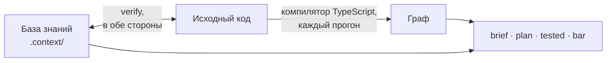

<div align="center">

[English](README.md) · **Русский**

# claudeHarness

<h3>Что держится вниманием — однажды будет нарушено.<br>
Что закреплено машиной — ненарушаемо по построению.</h3>

**Инженерная система машинного контроля качества кода для Claude Code.**<br>
Правила не просят соблюдать — их соблюдение проверяет машина.


</div>

ИИ-агент пишет код быстрее человека. Договорённости он забывает так же быстро:
промпты, инструкции, сотни скиллов — всё это лишь текст, а текст ничего не
гарантирует. Модель может прочесть его не целиком, забыть прочитанное,
сместить акценты, понять по-своему — или не исполнить вовсе. Чем длиннее свод
правил, тем больше в нём держится на одном внимании — и тем вернее однажды оно
подведёт. Первым подводит качество: тест, который не может упасть, второй
источник истины, граница, нарушенная «один раз», ошибка, проглоченная без
звука. Код работает, и ничто не показывает дефект, пока он не обойдётся
дорого.

**claudeHarness — не очередной набор скиллов и правил. Это инженерная
система контроля качества кода**: она превращает правила в машинные проверки,
берёт знание о коде из самого кода и не пускает в историю ничего
недоказанного. Каждая правка приносит свои тесты и документацию, сверяется с
планкой качества по каждому критерию — построчно и по уровням, вплоть до
приложения целиком — и запечатывается. Коммит без печати не
проходит, а агент не может закончить ход, пока правка не накрыта печатью. И
даже сами проверки не принимаются на веру: каждую регулярно ломают нарочно и
смотрят, заметит ли она.

- **Качество — перечень, а не впечатление.** Каждая правка сверяется с
  именованным списком критериев, с ответом по каждому, и запечатывается.
- **Проверка плоская и вертикальная.** Построчно — и вверх: файл, слой,
  приложение целиком, по фактам, которые инструмент вычисляет для каждого
  уровня. Правка, безупречная в каждой строке, всё равно может сломать
  целое; здесь это ловится.
- **Правила → проверки.** Что может проверить машина, проверяет машина; где
  не может — место записано и выведено в сводку, а не оставлено на
  внимательность.
- **Найдено — значит починено.** Дефект, замеченный по дороге, чинится в том
  же заходе и классом, а не откладывается на потом.
- **Тесты и документация — в каждой правке.** Просить о них не нужно; каждый
  тест проверен на способность упасть, остальное меряет мутационный прогон.
- **Знание из кода, а не из памяти.** Граф зависимостей, который компилятор
  строит заново при каждом прогоне, и база знаний, расхождение которой с кодом
  роняет прогон.
- **«Готово» значит «доказано».** Код возврата 0, запечатанный протокол и
  коммит через ворота качества — вместо «должно работать».
- **Экономия — в устройстве.** Качество не покупается перечитыванием
  всего проекта на каждой задаче: читается только область, которую вычисляет
  граф, правила грузятся в момент, когда нужны, а планка спрашивает только
  применимое.
- **Сделано для фронтенда.** Посадка настроена под React, TypeScript и Vite,
  на связке версий пакетов, на которой она проверена.

## Содержание

- [Зачем это](#зачем-это)
- [Чем это отличается](#чем-это-отличается)
- [Планка качества](#планка-качества)
- [Как это работает](#как-это-работает)
- [Откуда знание о коде](#откуда-знание-о-коде)
- [Экономия](#экономия)
- [Что входит в каждую правку](#что-входит-в-каждую-правку)
- [Стек: сделано для фронтенда](#стек-сделано-для-фронтенда)
- [Быстрый старт](#быстрый-старт)
- [Что внутри](#что-внутри)
- [Как проверяется сама обвязка](#как-проверяется-сама-обвязка)
- [Требования и границы](#требования-и-границы)
- [Статус](#статус)
- [Лицензия](#лицензия)

## Зачем это

Пять вещей, на которых спотыкается работа с ИИ-агентом, — и каждая обходится
коду его качеством:

- **Качество судят по впечатлению.** «Выглядит хорошо» принимают без
  возражений, а ответ по критерию сверяют с кодом. Один и тот же агент пишет
  заметно разный код в зависимости от того, что ему велели проверить.
- **Правило в прозе исполняется, пока о нём помнят.** Модель сама решает,
  применить ли инструкцию здесь и сейчас, — и однажды не применяет.
- **Каждая сессия начинается с чистого листа.** Что решено вчера и почему,
  уходит вместе с контекстом, и следующий заход «чинит» сделанное намеренно.
- **«Готово» без доказательства.** «Тесты должны проходить», «скорее всего
  работает» — утверждения, а не результаты.
- **Записи расходятся с кодом без признака.** Заметки и документация
  описывают код, которого уже нет, и читаются как правда.

## Чем это отличается

| Обычная настройка агента | claudeHarness |
| --- | --- |
| качество — «на вид нормально» | качество — ответ по каждому критерию, с опорой, под печатью |
| ревью читает строки диффа | правку проверяют построчно и вверх — файл, слой, приложение целиком, — сверяют с соседями, а всё новое — со всем проектом |
| дефект, замеченный по дороге, уходит в TODO | дефект, замеченный по дороге, чинится в том же заходе и классом |
| правило — абзац в промпте или скилле; исполняется, если модель вспомнила | правило держит машина; где не может — это записано и видно в сводке |
| агент узнаёт код поиском и догадкой | граф импортов строит из кода компилятор; база знаний сверяется с ним |
| агент на всякий случай читает весь проект — или пару файлов и догадывается | область правки вычисляется по графу и читается целиком; код за её пределами не читается |
| тесты и документацию пишут, когда попросят | тесты, записи и документация — часть каждой правки, а недостающее называет команда |
| «готово», потому что агент так написал | «готово» — полный набор проверок с кодом 0 и запечатанный протокол |
| заметки о проекте устаревают незаметно | база знаний сверяется с кодом каждым прогоном, в обе стороны |
| проверкам верят на слово | каждую проверку ломают нарочно и смотрят, покраснеет ли |
| чем больше правил, тем дороже каждый запрос | объём правил под бюджетом; история и обоснования лежат отдельно и не грузятся в каждую сессию |

## Планка качества

Планка — перечень, по которому сверяют любую работу с кодом: новый код,
починку, рефактор, ревью. Каждый критерий — вопрос к диффу с признаком,
который видно, а не принцип, с которым соглашаются. Критерии взяты из трёх
мест: принципы проектирования, переведённые в наблюдаемые признаки; карта
покрытия по ISO/IEC 25010 — карта, а не заявление о соответствии; и случаи —
дефект, прошедший сверку, дописывает признак, по которому его следовало
поймать. Разделы, предмета которых у проекта нет, — сеть, локали, конвейер
проверок, — объявлены неприменимыми, и планка их не спрашивает.

### Плоско и вертикально

Обычное ревью плоское: оно читает строки диффа. Но правка бывает безупречна в
каждой строке и при этом ломает целое — заводит второй источник истины, даёт
модулю вторую ответственность, выпускает наружу внутренность, импортирует
против направления слоёв. В строках этого не видно; видно уровнем выше.
Поэтому планка проверяет каждую правку в двух направлениях:

- **плоско** — каждую тронутую строку по построчным критериям: краевые входы,
  ошибки, типы, имена, числа, лишняя работа;
- **вертикально** — вверх по уровням, которым эти строки принадлежат:
  **узел** (файл или папка компонента), **слой**, **приложение целиком**.
  Каждый уровень судят по фактам, которые инструмент вычисляет для него:
  поверхность узла и что правка в ней сдвинула, его состояние и ресурсы;
  рёбра между слоями, циклы, обход входа; источники истины, писатели каждого
  ресурса, поток данных, потребители за областью правки и тест через каждого.

Хороший результат на одном уровне не закрывает плохой на другом: у каждого
уровня свой ответ. А всё новое сверяют не только с соседями, но и со всем
проектом: второй источник истины обычно появляется там, где о первом просто
не знали.

## Как это работает

Каждое обязательство в обвязке называет, чем оно держится: сверкой, воротами,
хуком или тестом. Где машинной опоры нет, это записано прямо, и такие места
собирает отдельная сводка: их видно, а не забывают.


## Откуда знание о коде

Суждение о качестве стоит ровно столько, сколько факты под ним. Агент без
памяти узнаёт код догадкой: ищет, читает пару файлов и достраивает остальное —
или читает всё подряд и платит за это на каждой задаче. claudeHarness даёт ему
два источника, и ни один из них не память модели.

**Граф — вычисляется, а не хранится.** `graph.mjs` разбирает каждый модуль
проекта при каждом прогоне — компилятором TypeScript из пакетов самого
проекта, а когда компилятора нет, регулярными выражениями. Он читает импорты
и переотдачи, импорты ради побочного эффекта, `import()` во время работы —
включая адреса-шаблоны, — экспорты и константы; разрешает короткие адреса,
объявленные в `tsconfig.json`; и ведёт связи по именам сквозь бочки, так что
модуль, берущий всё из входа пакета, всё равно показывает настоящие
зависимости. Отсюда ответы: чем файл пользуется и кто пользуется им, радиус
поражения правки, какие тесты доходят до файла, циклы, экспорты без
потребителей и импорты против объявленного направления слоёв.

**База знаний — записывается, а потом сверяется.** То, чего нельзя прочесть в
самом файле, лежит в `.context/`: почему сделано так и что можно вместо, кто
владеет состоянием и кто в него пишет, что сломается при смене порядка,
ограничения, которые держатся в другом файле, какой тест держит какое
поведение, и связи, которых граф импортов не видит, — тема шины событий, ключ
хранилища, CSS-переменная. Записи пишутся в формах, которые читает
инструмент, и `verify` сверяет их с кодом в обе стороны.

**Почему знание всегда актуально.** Вычисляемое пересчитывается при каждом
прогоне: его никто не записывал, и устареть ему нечему. Записанное сверяет
`verify` — последнее звено `npm run check`, которым кончается каждая правка:
запись, разошедшаяся с кодом, роняет его. Чисел, которые едут от любой
правки, в базе нет вовсе — их вычисляет команда в момент, когда они нужны.



## Экономия

Качество через чтение всего подряд на каждой задаче — дело нехитрое и
дорогое. Здесь у каждого чтения есть причина, и цена задачи следует её
размеру, а не размеру проекта:

- **Чтение ограничено графом.** Область правки — файл, то, чем он пользуется,
  кто пользуется им, его тесты — читается целиком; остальной код не читается.
  На вопрос «где это лежит» или «что решено» отвечает база знаний, не открывая
  кода.
- **Правила приходят, когда нужны.** Правила о коде грузятся, когда открыт
  код; справочник инструмента и таблица сверок — по требованию; история и
  обоснования — только когда правят само правило. Объём грузящихся правил
  держит бюджет в символах, и поднять его можно только видной в диффе правкой.
- **Планка спрашивает применимое.** Разделы, предмета которых в проекте нет,
  объявлены неприменимыми и не спрашиваются.
- **Машина заполняет, что может.** Линт, срезы кода и сверки сами отвечают на
  свои строки протокола; сессия тратит силы только там, где нужно суждение.

## Что входит в каждую правку

«Напиши функцию» — это не только функция. По умолчанию правка включает:

- **Тесты — в том же заходе.** Новый код сразу закрывается тестом. Изменённый
  заставляет открыть каждый тест, который его гоняет, и доказать, что тот
  ещё способен упасть: сломать код, увидеть, что покраснел именно этот тест,
  вернуть. Тест, который не может упасть, — дефект той же правки.
- **Мутационный прогон по тронутым файлам.** Stryker ломает код во всех
  местах сразу и показывает, где ни один тест не заметил. У каждого выжившего
  мутанта один из трёх исходов: добавлен тест, исправлен код или признан
  неубиваемым с конкретной причиной. Реестр замеров по хешу содержимого файла
  лежит в git, а `mutated` называет файлы, ни разу не мерянные или
  изменённые после замера.
- **Записи базы знаний** во всех её файлах, каких касается правка, — карта,
  состояние, порядок выполнения, сценарии, ограничения, решения, реестр
  тестов, — и у соседей, чьё описание правка изменила.
- **Документация, когда появилось «почему»**: запись решения с вариантами и
  ценой, устройство слоя, смысл настройки, README папки компонента. Витрина
  возможностей правится при каждом поведении, видном снаружи. Комментарии
  редки и коротки, и их длину проверяет машина.
- **Гарантия поведения** для новой возможности: что продукт обещает, откуда
  обещание взято и какой тест его держит.
- **Свод по планке качества и печать**: ответ по каждому живому критерию,
  построчно и на каждом уровне, и всё найденное в области починено.
- **Отчёт числами**: какие проверки прогнаны и с каким кодом возврата; база
  знаний и документация подтверждаются порознь.

Сузить объём можно прямой просьбой («только набросок», «без тестов») — тогда
это будет сказано в отчёте.

Главные команды — все через `node .claude/tools/graph.mjs`:

| Команда | Что делает |
| --- | --- |
| `bar` | свод по планке качества и печать |
| `brief <путь>` | досье на файл: чем он пользуется, кто пользуется им, какие тесты до него доходят, что о нём записано |
| `plan <путь>` | что придётся тронуть до правки: радиус, тесты, записи |
| `tested` | правка против её тестов, базы и документации |
| `mutated` | долг мутационного прогона по правке |
| `verify` | все сверки базы с кодом разом |

## Стек: сделано для фронтенда

Обвязка разрабатывалась под практические задачи в конкретном окружении —
фронтенд-приложения на **React + TypeScript + Vite**. На этой конкретности и
держится её гарантия качества. Скилл «пиши хороший код» одинаково подходит к
Python, React и Angular — потому что ничего не проверяет. Правило, которое
проверяет машина, обязано знать, что проверяет: каким компилятором строится
граф, какие правила линта стоят за критериями, где компонент держит свои
стили. Поэтому силы ушли в глубину, а не в ширину: в полноту анализа, в
строгость проверки каждого критерия и в надёжность, с которой результат
достигает цели. Посадка настроена под этот стек:

- конфиги компилятора, линтера, форматтера, раннера тестов и мутационного
  прогона приезжают заготовками, уже связанными в одну цепочку проверок,
  `npm run check`;
- за планкой стоят строгие инструменты: TypeScript в строгом режиме,
  typescript-eslint в строгом режиме с проверкой типов, строгие правила React,
  наборы правил хуков, доступности и SonarJS; где настройка обвязки строже
  проектной, ставится обвязкина, и отчёт об этом говорит;
- часть проверок знает стек: имена классов из кода обязаны быть в листе
  стилей компонента.

**Проверенная связка версий.** Посадка проверена на конкретном наборе версий,
объявленном в семени настройки:

| Область | Пакеты |
| --- | --- |
| среда | Node.js 22.23.2, npm 11.0.0 |
| язык и сборка | TypeScript 6.0.3, Vite 8.3.0 |
| интерфейс | React 19.3.0, React DOM 19.3.0, Sass (sass-embedded) 1.89.2 |
| тесты | Vitest 4.1.11, jsdom 30.0.1, Testing Library React 16.3.3, Stryker 10.0.0 |
| линт и формат | ESLint 10.10.0, @eslint-react 5.24.2, jsx-a11y-x 0.2.0, SonarJS 4.2.2, Prettier 3.9.6 |

На машине, где Node.js или npm ниже связки, посадка останавливается до первой
правки. В живом проекте ничего не обновляется: посадка доставляет только
отсутствующее, а пакеты ниже связки называет прогон — уведомлением, а не
падением; обновляться или нет, решаете вы.

**Другие стеки.** Граф, база знаний, планка качества и большинство сверок
работают на любом коде на TypeScript или JavaScript; заготовки и сверки,
знающие стек, рассчитаны на React и Vite. Перенести обвязку на другой стек
нетрудно: принципы остаются те же, меняются только заготовки и сверки,
знающие стек. Берите идеи и инструменты — остальное агент доделает, посадит
и допилит.

## Быстрый старт

```bash
git clone https://github.com/Igor-lx/claudeHarness.git tmp
cp -r tmp/.claude <ваш проект>/
rm -rf tmp
```

Затем в Claude Code, в папке проекта:

- **«посади обвязку»** — ассистент разложит конфиги, базу знаний, ворота и
  проверки и прогонит их по инструкции `.claude/seat/seat.md`;
- **«делаем переход»** — в проекте, где код уже есть, после посадки:
  ассистент прочитает весь код, соберёт базу знаний и документацию, а всё, в
  чём проект расходится с правилами и планкой качества, запишет долгом с
  планом приведения. Код при этом не меняется.

Если в проекте уже есть `.claude`, копирование её не затирает: разрешения
среды обвязка дописывает в ваш файл. Совпадающие имена других файлов стоит
сличить до копирования.

## Что внутри

| Папка | Что там |
| --- | --- |
| `rules/` | правила работы: планка качества, порядок работы, устройство базы, запись прозы, среда |
| `tools/` | инструмент `graph.mjs`, его справочник, таблица сверок, рецепты фальсификации |
| `skills/` | скиллы: вход в задачу, пробы, проба планки, аудит, сборка для передачи |
| `seat/` | посадка: инструкция, карта и заготовки всех файлов проекта |
| `hooks/` | ворота качества перед коммитом |
| `state/` | открытые вопросы и отложенная работа по самой обвязке |
| `rationale/` | обоснования правил: история, замеры, отклонённые варианты |

Подробно, с устройством каждой части, — [`.claude/README.md`](.claude/README.md).

## Как проверяется сама обвязка

Обвязка, которая требует доказательств, обязана доказывать и себя. Её
проверяют четыре инструмента, у каждого свой вопрос:

| Чем | Вопрос |
| --- | --- |
| режим `falsify` | ловит ли каждая сверка свою поломку |
| скилл `probe` | справляется ли обвязка с живой задачей — и чем это удержано |
| скилл `bar-probe` | находит ли свод по планке качества дефект, посаженный в код |
| скилл `audit` | нет ли в самих правилах дыр, противоречий и мест, где машина могла бы держать то, что держится прозой |

## Требования и границы

**Нужно:** Node.js 22.23.2 и новее, npm 11 и новее, git, Claude Code; стек —
в разделе [«Стек: сделано для фронтенда»](#стек-сделано-для-фронтенда).

**Язык:** правила и вывод инструмента — на русском.

**Чего обвязка не обещает:**

- судит код, а не продукт: проверки устанавливают, что код прошёл планку,
  поведение не сломано и записи верны, — а не то, делает ли продукт
  задуманное; какие характеристики качества остаются вне планки, называет
  карта по ISO/IEC 25010;
- суждения — та ли граница у модуля, честно ли он назван — держит чтение;
  насколько хорошо, меряет `bar-probe`;
- последнее слово за вами: любое правило обходится вашей прямой командой, и
  обход называется в отчёте.

## Статус

**Функционально готово; идёт доводка.** Всё описанное здесь на месте и
работает: планка качества и печать, граф и база знаний, ворота, посадка и
переход, самопроверки. Архитектура и замысел устоялись и меняться не будут.
Сейчас работа идёт над тем, насколько хорошо всё это работает: доводка,
исправление ошибок и тестирование — у каждого критерия планки есть посаженный
дефект, и пробы меряют, ловит ли его свод. Детали правил, сверок и вывода
инструмента от версии к версии ещё могут меняться.

## Лицензия

[MIT](LICENSE) — свободное использование, изменение и распространение при
сохранении уведомления об авторстве.

---

<sub>**Ключевые слова:** качество кода, контроль качества кода, ворота
качества, Claude Code, обвязка для Claude Code, харнесс, харнесс-инжиниринг,
харнесс-обвязка, ИИ-агент, агентное программирование, промпт-инжиниринг,
контекст-инжиниринг, ревью кода, чистый код, архитектура, база знаний о коде,
граф зависимостей, мутационное тестирование, автоматизация тестов,
документация как код, фронтенд, React, TypeScript, Vite, Vitest.</sub>
