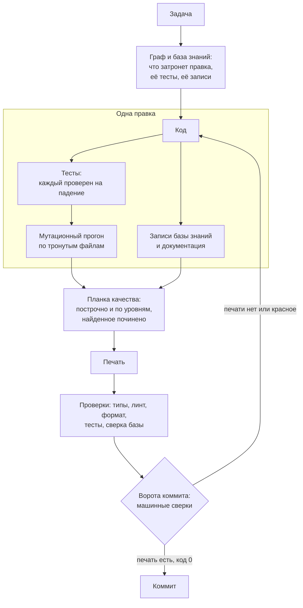
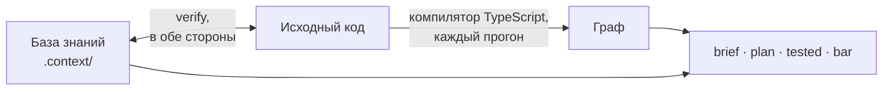

<div align="center">

[English](README.md) · **Русский**

# claudeHarness

**Качество фронтенд-кода для Claude Code, которое держит машина, а не внимание.**

Дайте агенту задачу - получите код, тесты и документацию, доказанные машинными
проверками.<br>Без доказательства агент не закончит работу, а коммит не пройдёт.


[Как это выглядит](#как-это-выглядит) · [Быстрый старт](#быстрый-старт) · [Чем это отличается](#чем-это-отличается) · [Как это работает](#как-это-работает) · [Установка и настройка](#установка-и-настройка)

</div>

ИИ-агент пишет код быстрее человека. Договорённости он забывает так же быстро:
промпты, инструкции, сотни скиллов - всё это лишь текст, а текст ничего не
гарантирует. Модель работает в собственном, неисповедимом контексте - в своём
порядке, объёме и направлении суждений, - и один и тот же текст в разных
условиях даёт разный результат: она может прочесть его не целиком, забыть
прочитанное, сместить акценты, понять по-своему - или не исполнить вовсе. Чем
длиннее свод правил, тем больше в нём держится на одном
внимании - и тем вернее однажды оно подведёт. Первым подводит качество: тест,
который не может упасть, второй источник истины, граница, нарушенная «один
раз», ошибка, проглоченная без звука. Код работает, и ничто не показывает
дефект, пока он не обойдётся дорого.

<h3 align="center">Что держится вниманием - однажды будет нарушено.<br>
Что закреплено машиной - ненарушаемо по построению.</h3>

## claudeHarness - не ещё один из сотен наборов скиллов и правил

Это инженерная система контроля качества кода: она превращает правила в
машинные проверки, берёт знание о коде из самого кода и не пускает в историю
ничего недоказанного. Каждая правка приносит свои тесты и документацию,
сверяется с планкой качества по каждому критерию - построчно и по уровням,
вплоть до приложения целиком - и запечатывается. Коммит без печати не
проходит, а агент не может закончить ход, пока правка не накрыта печатью.
Поэтому качество не зависит ни от удачи, ни от истории сессии: на каждом
заходе его держат одни и те же проверки - предсказуемо и воспроизводимо. И
даже сами проверки не принимаются на веру: каждую регулярно ломают нарочно и
смотрят, заметит ли она.

- **Качество - перечень, а не впечатление.** Каждая правка сверяется с
  именованным списком критериев, с ответом по каждому, и запечатывается.
- **Правило становится проверкой.** Что может проверить машина, проверяет
  машина; где не может - место записано и выведено в сводку, а не оставлено
  на внимательность.
- **Проверка плоская и вертикальная.** Построчно - и вверх: файл, слой,
  приложение целиком, по фактам, которые инструмент вычисляет для каждого
  уровня. Правка, безупречная в каждой строке, всё равно может сломать
  целое; здесь это ловится.
- **Найдено - значит починено.** Дефект, замеченный по дороге, чинится в том
  же заходе и классом, а не откладывается на потом.
- **Тесты и документация - в каждой правке.** Просить о них не нужно; каждый
  тест проверен на способность упасть, остальное меряет мутационный прогон.
- **Знание из кода, а не из памяти.** Граф зависимостей, который компилятор
  строит заново при каждом прогоне, и база знаний, расхождение которой с кодом
  роняет прогон.
- **«Готово» значит «доказано».** Код возврата 0, запечатанный протокол и
  пропуск ворот коммита - вместо «должно работать».
- **Экономия - в устройстве.** Качество не покупается перечитыванием всего
  проекта на каждой задаче: читается только область, которую вычисляет граф,
  правила грузятся в момент, когда нужны, а планка спрашивает только
  применимое.
- **Сделано для фронтенда.** Посадка настроена под React, TypeScript и Vite,
  на связке версий пакетов, на которой она проверена.

## Как это выглядит

Обычно работа кончается словами агента «Готово» - и проверять результат
приходится вам. Здесь последнее слово за машиной: **ворота коммита** не пускают
в историю непроверенное, а **планка качества** - перечень критериев, с которым
сверяют каждую правку.

> 🟠 **агент:** Готово, тесты проходят.

> 🔵 **ворота коммита:** Коммит не пройдёт: работа не сверена с планкой качества.<br>
> 🟣 **планка качества:** Сверку не принимаю: критерий закрыт «чисто», а нарушение по нему уже найдено.

> 🟠 **агент:** Чиню найденное, дописываю тесты, сверяю заново.

> 🟣 **планка качества:** Принято: найдено два, починено два - ставлю печать.<br>
> 🔵 **ворота коммита:** Печать есть - коммит проходит.

Тот же заход в выводе инструмента - в разделе
[«Пример из терминала»](#пример-из-терминала).

## Быстрый старт

1. Склонируйте этот репозиторий.
2. Скопируйте папку `.claude` в корень своего проекта.
3. Откройте проект в Claude Code и скажите: **«посади обвязку»**.

Дальше - обычные задачи обычными словами. Проект с готовым кодом, требования
и все тонкости - в разделе [«Установка и настройка»](#установка-и-настройка).

## Чем это отличается

| Обычная настройка агента | claudeHarness |
| --- | --- |
| качество - «на вид нормально» | качество - ответ по каждому критерию, с опорой, под печатью |
| правило - абзац в промпте или скилле; исполняется, если модель вспомнила | правило держит машина; где не может - это записано и видно в сводке |
| ревью читает строки диффа | правку проверяют построчно и вверх - файл, слой, приложение целиком, - сверяют с соседями, а всё новое - со всем проектом |
| дефект, замеченный по дороге, уходит в TODO | дефект, замеченный по дороге, чинится в том же заходе и классом |
| агент узнаёт код догадкой - или читает весь проект на всякий случай | граф строит компилятор; область правки вычисляется по нему и читается целиком |
| тесты и документацию пишут, когда попросят | тесты, записи и документация - часть каждой правки, а недостающее называет команда |
| «готово», потому что агент так написал | «готово» - полный набор проверок с кодом 0 и запечатанный протокол |
| заметки о проекте устаревают незаметно | база знаний сверяется с кодом каждым прогоном, в обе стороны |
| проверкам верят на слово | каждую проверку ломают нарочно и смотрят, покраснеет ли |
| чем больше правил, тем дороже каждый запрос | объём правил под бюджетом; история и обоснования лежат отдельно и не грузятся в каждую сессию |

## Как это работает

```
ПРАВИЛО  →  ПРОВЕРКА  →  ДОКАЗАТЕЛЬСТВО  →  ПЕЧАТЬ  →  КОММИТ
```

Каждое обязательство в обвязке называет, чем оно держится: сверкой, воротами,
хуком или тестом. Где машинной опоры нет, это записано прямо, и такие места
собирает отдельная сводка - они остаются на виду и не забываются.



### Пример из терминала

Заход из раздела «Как это выглядит», сокращённо; сообщения - те, что печатает
инструмент:

```
$ git commit
=== Ворота перед коммитом ===
  КОММИТ НЕ ПРОХОДИТ: свода нет вовсе
  Свод по планке делают ДО коммита: node .claude/tools/graph.mjs bar

$ node .claude/tools/graph.mjs bar          # ответ по каждому критерию
  дыр: 1
    E9: чисто со ссылкой на находку другого критерия
  Печать не поставлена. Свод с дырами — не свод.

$ node .claude/tools/graph.mjs bar          # найденное починено, тесты дописаны
  печать поставлена: 4df9ed3b9cd2
  находок: 2
    E9 …/RemoveButton.tsx:6 — двойное нажатие запускает удаление дважды (починено)
    E3 …/pageSize.ts:2 — вход снаружи тихо исправляется вместо проверки (починено)

$ git commit
  свод покрывает правку: коммит проходит
```

Двойное нажатие агент записал находкой по одному критерию, а `E9`, который
называет его прямо, закрыл словом «чисто» - и печати не получил. Закончить ход
без печати он тоже не может: хук конца хода остановит его и назовёт, чего не
хватает.

## Ворота коммита и планка качества

Ворота коммита - машинная сверка перед каждым коммитом: правка проходит в
историю, только если её накрывает запечатанная сверка с планкой качества.
Цепочку проверок - типы, линт, формат, тесты, сверку базы - агент прогоняет
до неё, а хук конца хода не даёт ему закончить работу без печати.

Планка качества - перечень, по которому сверяют любую работу с кодом: новый код,
починку, рефактор, ревью. Каждый критерий - вопрос к диффу с признаком,
который видно, а не принцип, с которым соглашаются. Критерии взяты из трёх
мест: принципы проектирования, переведённые в наблюдаемые признаки; карта
покрытия по ISO/IEC 25010 - карта, а не заявление о соответствии; и случаи -
дефект, прошедший сверку, дописывает признак, по которому его следовало
поймать. Разделы, предмета которых у проекта нет, - сеть, локали, конвейер
проверок, - объявлены неприменимыми, и планка их не спрашивает.

Обычное ревью плоское: оно читает строки диффа. Но правка бывает безупречна в
каждой строке и при этом ломает целое - заводит второй источник истины, даёт
модулю вторую ответственность, выпускает наружу внутренность, импортирует
против направления слоёв. В строках этого не видно; видно уровнем выше.
Поэтому планка проверяет каждую правку в двух направлениях:

- **плоско** - каждую тронутую строку по построчным критериям: краевые входы,
  ошибки, типы, имена, числа, лишняя работа;
- **вертикально** - вверх по уровням, которым эти строки принадлежат:
  **узел** (файл или папка компонента), **слой**, **приложение целиком**.
  Каждый уровень судят по фактам, которые инструмент вычисляет для него:
  поверхность узла и что правка в ней сдвинула, его состояние и ресурсы;
  рёбра между слоями, циклы, обход входа; источники истины, писатели каждого
  ресурса, поток данных, потребители за областью правки и тест через каждого.

Ответ одного критерия не закрывает другой: найденное отмечается везде, где его
называет критерий, а у каждого уровня свой ответ. Всё новое сверяют не только
с соседями, но и со всем проектом: второй источник истины обычно появляется
там, где о первом просто не знали.

## Откуда знание о коде

Суждение о качестве стоит ровно столько, сколько факты под ним. Агент без
памяти узнаёт код догадкой: ищет, читает пару файлов и достраивает остальное -
или читает всё подряд и платит за это на каждой задаче. claudeHarness даёт ему
два источника, и ни один из них не память модели.

**Граф - вычисляется, а не хранится.** `graph.mjs` разбирает каждый модуль
проекта при каждом прогоне - компилятором TypeScript из пакетов самого
проекта, а когда компилятора нет, регулярными выражениями. Он читает импорты
и переотдачи, импорты ради побочного эффекта, `import()` во время работы,
экспорты и константы; разрешает короткие адреса из `tsconfig.json` и ведёт
связи по именам сквозь бочки. Отсюда ответы: чем файл пользуется и кто
пользуется им, радиус поражения правки, какие тесты доходят до файла, циклы,
экспорты без потребителей и импорты против объявленного направления слоёв.

**База знаний - записывается, а потом сверяется.** То, чего нельзя прочесть в
самом файле, лежит в `.context/`: почему сделано так и что можно вместо, кто
владеет состоянием и кто в него пишет, что сломается при смене порядка, какой
тест держит какое поведение, и связи, которых граф импортов не видит, - тема
шины событий, ключ хранилища, CSS-переменная. Записи пишутся в формах,
которые читает инструмент, и `verify` - последнее звено `npm run check` -
сверяет их с кодом в обе стороны: запись, разошедшаяся с кодом, роняет
прогон. Чисел, которые едут от любой правки, в базе нет вовсе - их вычисляет
команда в момент, когда они нужны.



## Что входит в каждую правку

«Напиши функцию» - это не только функция. По умолчанию правка включает:

- **тесты - в том же заходе**: новый код сразу закрывается тестом, а каждый
  тест, который гоняет изменённый код, доказывает, что ещё способен упасть;
- **мутационный прогон по тронутым файлам**: Stryker ломает код во всех
  местах сразу, и у каждого выжившего мутанта один из трёх исходов - добавлен
  тест, исправлен код или признан неубиваемым с конкретной причиной;
- **записи базы знаний** во всех её файлах, каких касается правка, и у
  соседей, чьё описание правка изменила;
- **документацию, когда появилось «почему»**: запись решения с вариантами и
  ценой, устройство слоя, смысл настройки, README папки компонента;
- **гарантию поведения** для новой возможности: что продукт обещает, откуда
  обещание взято и какой тест его держит;
- **свод по планке и печать**: ответ по каждому живому критерию, построчно и
  на каждом уровне, и всё найденное в области починено;
- **отчёт числами**: какие проверки прогнаны и с каким кодом возврата.

Сузить объём можно прямой просьбой («только набросок», «без тестов») - тогда
это будет сказано в отчёте.

| Команда (`node .claude/tools/graph.mjs …`) | Что делает |
| --- | --- |
| `bar` | свод по планке качества и печать |
| `brief <путь>` | досье на файл: чем он пользуется, кто пользуется им, какие тесты до него доходят, что о нём записано |
| `plan <путь>` | что придётся тронуть до правки: радиус, тесты, записи |
| `tested` | правка против её тестов, базы и документации |
| `mutated` | долг мутационного прогона по правке |
| `verify` | все сверки базы с кодом разом |

## Экономия

Качество через чтение всего подряд на каждой задаче - дело нехитрое и
дорогое. Здесь у каждого чтения есть причина, и цена задачи следует её
размеру, а не размеру проекта:

- **Чтение ограничено графом.** Область правки - файл, то, чем он пользуется,
  кто пользуется им, его тесты - читается целиком; остальной код не читается.
  На вопрос «где это лежит» или «что решено» отвечает база знаний, не открывая
  кода.
- **Правила приходят, когда нужны.** Правила о коде грузятся, когда открыт
  код; справочник инструмента и таблица сверок - по требованию; история и
  обоснования - только когда правят само правило. Объём грузящихся правил
  держит бюджет в символах, и поднять его можно только видной в диффе правкой.
- **Машина заполняет, что может.** Линт, срезы кода и сверки сами отвечают на
  свои строки протокола; сессия тратит силы только там, где нужно суждение.

## Стек: сделано для фронтенда

Обвязка разрабатывалась под практические задачи в конкретном окружении -
фронтенд-приложения на **React + TypeScript + Vite**. На этой конкретности и
держится её гарантия качества. Скилл «пиши хороший код» одинаково подходит к
Python, React и Angular - потому что ничего не проверяет. Правило, которое
проверяет машина, обязано знать, что проверяет: каким компилятором строится
граф, какие правила линта стоят за критериями, где компонент держит свои
стили. Поэтому силы ушли в глубину, а не в ширину: в полноту анализа, в
строгость проверки каждого критерия и в надёжность, с которой результат
достигает цели. Посадка настроена под этот стек:

- конфиги компилятора, линтера, форматтера, раннера тестов и мутационного
  прогона приезжают заготовками, уже связанными в одну цепочку проверок,
  `npm run check`;
- за планкой стоят строгие инструменты: TypeScript в строгом режиме,
  typescript-eslint в строгом режиме с проверкой типов, строгие правила React,
  наборы правил хуков, доступности и SonarJS; где настройка обвязки строже
  проектной, ставится обвязкина, и отчёт об этом говорит;
- часть проверок знает стек: имена классов из кода обязаны быть в листе
  стилей компонента.

**Проверенная связка версий.** Посадка проверена на конкретном наборе версий,
объявленном в семени настройки:

| Область | Пакеты |
| --- | --- |
| среда | Node.js 22.23.2, npm 11.0.0 |
| язык и сборка | TypeScript 6.0.3, Vite 8.3.0 |
| интерфейс | React 19.3.0, React DOM 19.3.0, Sass (sass-embedded) 1.89.2 |
| тесты | Vitest 4.1.11, jsdom 30.0.1, Testing Library React 16.3.3, Stryker 10.0.0 |
| линт и формат | ESLint 10.10.0, @eslint-react 5.24.2, jsx-a11y-x 0.2.0, SonarJS 4.2.2, Prettier 3.9.6 |

На машине, где Node.js или npm ниже связки, посадка останавливается до первой
правки. В живом проекте ничего не обновляется: посадка доставляет только
отсутствующее, а пакеты ниже связки называет прогон - уведомлением, а не
падением; обновляться или нет, решаете вы.

**Другие стеки.** Граф, база знаний, планка качества и большинство сверок
работают на любом коде на TypeScript или JavaScript; заготовки и сверки,
знающие стек, рассчитаны на React и Vite. Перенести обвязку на другой стек
нетрудно: принципы остаются те же, меняются только заготовки и сверки,
знающие стек. Берите идеи и инструменты - остальное агент доделает, посадит
и допилит.

## Установка и настройка

**Что нужно:** Node.js 22.23.2 и новее, npm 11 и новее, git и Claude Code.

**1. Скопировать обвязку** в корень проекта:

```bash
git clone https://github.com/Igor-lx/claudeHarness.git tmp
cp -r tmp/.claude <ваш проект>/
rm -rf tmp
```

Если в проекте уже есть `.claude`, копирование её не затирает: разрешения
среды обвязка дописывает в ваш файл. Совпадающие имена других файлов стоит
сличить до копирования.

**2. Открыть проект в Claude Code - из его папки.** Разрешения, ворота и хуки
обвязки среда берёт из папки, где стартовала сессия. Стартовали уровнем
выше - выполните `/cd <проект>` или перезапустите сессию в папке проекта,
иначе они не действуют.

**3. Сказать «посади обвязку».** Ассистент по инструкции
`.claude/seat/seat.md` разложит конфиги, базу знаний, ворота и проверки,
допишет в манифест недостающие команды и пакеты, не трогая ни одной
существующей версии, прогонит цепочку проверок и отчитается числами. В пустой
проект ляжет каркас - маленькое приложение с тестом, чтобы проверкам было на
чём работать с первого дня; в проект с кодом каркас не кладётся. Node.js или
npm ниже связки останавливают посадку до первой правки; пакеты ниже связки
прогон называет уведомлением - обновляться или нет, решаете вы.

**4. Проект с готовым кодом - «делаем переход».** Ассистент прочитает весь
код, соберёт базу знаний, граф связей и документацию, а всё, в чём проект
расходится с правилами и планкой качества, запишет долгом с планом
приведения. Код при этом не меняется. Долг печатается каждым прогоном и
уменьшается, когда работа задевает его места: найденное там чинится тем же
заходом.

**5. Работать.** Задачи - обычными словами. Правка по умолчанию приходит с
тестами, записями базы, документацией и печатью; сузить объём можно прямой
просьбой.

**Развилки решаете вы.** Где решение может принять только человек - публичный
контракт, поведение продукта, сами правила, - агент не решает за вас: он
задаёт вопрос, записывает его в базу и называет первым в каждом отчёте, пока
нет ответа.

**Коммиты - по вашей команде.** Агент не коммитит по своей инициативе и не
снимает ворота перед коммитом даже по команде: коммит мимо ворот вы делаете
сами. Любое другое правило обходится вашей прямой командой, и обход
называется в отчёте.

## Что внутри

| Папка | Что там |
| --- | --- |
| `rules/` | правила работы: планка качества, порядок работы, устройство базы, запись прозы, среда |
| `tools/` | инструмент `graph.mjs`, его справочник, таблица сверок, рецепты фальсификации |
| `skills/` | скиллы: вход в задачу, пробы, проба планки, аудит, сборка для передачи |
| `seat/` | посадка: инструкция, карта и заготовки всех файлов проекта |
| `hooks/` | ворота коммита - хук перед каждым коммитом |
| `state/` | открытые вопросы и отложенная работа по самой обвязке |
| `rationale/` | обоснования правил: история, замеры, отклонённые варианты |

Подробно, с устройством каждой части, - [`.claude/README.md`](.claude/README.md).

## Как проверяется сама обвязка

Обвязка, которая требует доказательств, обязана доказывать и себя. Её
проверяют четыре инструмента, у каждого свой вопрос:

| Чем | Вопрос |
| --- | --- |
| режим `falsify` | ловит ли каждая сверка свою поломку |
| скилл `probe` | справляется ли обвязка с живой задачей - и чем это удержано |
| скилл `bar-probe` | находит ли свод по планке дефект, посаженный в код: у каждого критерия есть своя посадка на стенде проб |
| скилл `audit` | нет ли в самих правилах дыр, противоречий и мест, где машина могла бы держать то, что держится прозой |

## Границы

**Язык:** правила и вывод инструмента - на русском.

**Чего обвязка не обещает:**

- судит код, а не продукт: проверки устанавливают, что код прошёл планку,
  поведение не сломано и записи верны, - а не то, делает ли продукт
  задуманное; какие характеристики качества остаются вне планки, называет
  карта по ISO/IEC 25010;
- суждения - та ли граница у модуля, честно ли он назван - держит чтение;
  насколько хорошо, меряет `bar-probe`;
- последнее слово за вами: правила обходятся вашей прямой командой, и обход
  называется в отчёте.

## Статус

**Функционально готово; идёт доводка.** Всё описанное здесь на месте и
работает: планка качества и печать, граф и база знаний, ворота, посадка и
переход, самопроверки. Архитектура и замысел устоялись и меняться не будут.
Сейчас работа идёт над тем, насколько хорошо всё это работает: доводка,
исправление ошибок и тестирование - у каждого критерия планки есть посаженный
дефект, и пробы меряют, ловит ли его свод. Детали правил, сверок и вывода
инструмента от версии к версии ещё могут меняться.

## Лицензия

[MIT](LICENSE) - свободное использование, изменение и распространение при
сохранении уведомления об авторстве.

---

<sub>**Ключевые слова:** качество кода, контроль качества кода, ворота
качества, Claude Code, обвязка для Claude Code, харнесс, харнесс-инжиниринг,
харнесс-обвязка, ИИ-агент, агентное программирование, промпт-инжиниринг,
контекст-инжиниринг, ревью кода, чистый код, архитектура, база знаний о коде,
граф зависимостей, мутационное тестирование, автоматизация тестов,
документация как код, фронтенд, React, TypeScript, Vite, Vitest.</sub>
