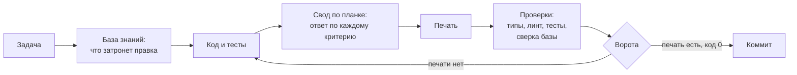

<div align="center">

[English](README.md) · **Русский**

# claudeHarness

<h3>Что держится вниманием — однажды будет нарушено.<br>
Что закреплено машиной — ненарушаемо по построению.</h3>

**Рабочий порядок для Claude Code, в котором правила не просят соблюдать —
их соблюдение проверяет машина.**


</div>

ИИ-агент пишет код быстрее человека. Договорённости он забывает так же быстро:
промпты, инструкции, десятки скиллов — всё это текст, который модель может
прочесть, может понять по-своему и может не исполнить. Чем длиннее свод
правил, тем больше в нём держится на одном внимании — и тем вернее однажды
оно подведёт.

**claudeHarness переворачивает эту схему.** Правило, которое можно проверить,
проверяет машина. База знаний о проекте сверяется с кодом при каждом прогоне.
Работа по коду проходит планку качества по каждому критерию и запечатывается.
Коммит без печати не проходит, а агент не может закончить ход, пока правка не
накрыта печатью. И даже сами проверки не принимаются на веру: каждую
регулярно ломают нарочно и смотрят, заметит ли она.

- **Правила → проверки.** Больше сотни машинных сверок вместо надежды на
  внимательность.
- **Память, которой можно верить.** База знаний переживает сессии, а
  расхождение записи с кодом роняет прогон.
- **«Готово» значит «доказано».** Код возврата 0, запечатанный протокол и
  коммит через ворота — вместо «должно работать».

## Содержание

- [Зачем это](#зачем-это)
- [Как это работает](#как-это-работает)
- [Чем это отличается](#чем-это-отличается)
- [Быстрый старт](#быстрый-старт)
- [Что меняется в работе](#что-меняется-в-работе)
- [Что внутри](#что-внутри)
- [Как проверяется сама обвязка](#как-проверяется-сама-обвязка)
- [Требования и границы](#требования-и-границы)
- [Статус](#статус)
- [Лицензия](#лицензия)

## Зачем это

Четыре вещи, на которых спотыкается работа с ИИ-агентом:

- **Правило в прозе исполняется, пока о нём помнят.** Модель сама решает,
  применить ли инструкцию здесь и сейчас, — и однажды не применяет.
- **Каждая сессия начинается с чистого листа.** Что решено вчера и почему,
  уходит вместе с контекстом, и следующий заход «чинит» сделанное намеренно.
- **«Готово» без доказательства.** «Тесты должны проходить», «скорее всего
  работает» — утверждения, а не результаты.
- **Записи расходятся с кодом без признака.** Заметки и документация
  описывают код, которого уже нет, и читаются как правда.

## Как это работает

Каждое обязательство в обвязке называет, чем оно держится: сверкой, воротами,
хуком или тестом. Где машинной опоры нет, это записано прямо, и такие места
собирает отдельная сводка: их видно, а не забывают.

| Что гарантируется | Чем держится |
| --- | --- |
| база знаний соответствует коду | `verify`: файл без записи, запись о несуществующем файле, съехавший якорь, переименованное имя — прогон завершается ненулевым кодом |
| код проверен по планке качества | `bar`: протокол с ответом по каждому живому критерию и печать; правка после печати её снимает |
| непроверенный код не попадает в историю | git-хук перед коммитом: код без печати — отказ; обход ворот ловят страж и ревизия истории |
| агент не бросает работу на полпути | хук конца хода Claude Code: правка кода без печати не даёт закончить ход |
| проверки действительно ловят | `falsify`: у каждой сверки есть рецепт поломки или тест, который её ломает; не покраснела — сломана сама сверка |
| свод не разрастается | бюджет объёма правил: новое правило называет, что оно вытесняет |



## Чем это отличается

| Обычная настройка агента | claudeHarness |
| --- | --- |
| правило — абзац в промпте или скилле; исполняется, если модель вспомнила | правило держит машина; где не может — это записано и видно в сводке |
| «готово», потому что агент так написал | «готово» — полный набор проверок с кодом 0 и запечатанный протокол |
| заметки о проекте устаревают незаметно | база знаний сверяется с кодом каждым прогоном, в обе стороны |
| проверкам верят на слово | каждую проверку ломают нарочно и смотрят, покраснеет ли |
| чем больше правил, тем дороже каждый запрос | объём правил под бюджетом; история и обоснования лежат отдельно и не грузятся в каждую сессию |

## Быстрый старт

```bash
git clone https://github.com/Igor-lx/claudeHarness.git tmp
cp -r tmp/.claude <ваш проект>/
rm -rf tmp
```

Затем в Claude Code, в папке проекта:

- **«посади обвязку»** — ассистент разложит конфиги, базу знаний, ворота и
  проверки и прогонит их по инструкции `.claude/seat/seat.md`;
- **«делаем переход»** — в проекте, где код уже есть, после посадки:
  ассистент прочитает весь код, соберёт базу знаний и документацию, а всё, в
  чём проект расходится с правилами, запишет долгом с планом приведения. Код
  при этом не меняется.

Если в проекте уже есть `.claude`, копирование её не затирает: разрешения
среды обвязка дописывает в ваш файл. Совпадающие имена других файлов стоит
сличить до копирования.

## Что меняется в работе

- **«Напиши функцию» включает тесты** — в том же заходе, и каждый тест
  проверен на способность упасть.
- **База знаний ведётся по ходу**: за что отвечает файл, какое состояние
  держит, что сделано намеренно. Следующая сессия читает это вместо всего
  кода.
- **Перед коммитом — свод по планке**: ответ по каждому критерию качества и
  печать.
- **Отчёт — числами**: какие проверки прогнаны и с каким кодом возврата, а не
  «всё работает».
- Сузить объём можно прямой просьбой («только набросок») — тогда это будет
  сказано в отчёте.

Главные команды — все через `node .claude/tools/graph.mjs`:

| Команда | Что делает |
| --- | --- |
| `verify` | все сверки базы с кодом разом |
| `brief <путь>` | досье на файл: кто его берёт, чем он накрыт, что о нём записано |
| `plan <путь>` | что придётся тронуть до правки: радиус, тесты, записи |
| `tested` | правка против её тестов, базы и документации |
| `bar` | свод по планке качества и печать |

## Что внутри

| Папка | Что там |
| --- | --- |
| `rules/` | правила работы: порядок, планка качества, устройство базы, запись прозы, среда |
| `tools/` | инструмент `graph.mjs`, его справочник, таблица сверок, рецепты фальсификации |
| `skills/` | скиллы: вход в задачу, пробы, проба планки, аудит, сборка для передачи |
| `seat/` | посадка: инструкция, карта и заготовки всех файлов проекта |
| `hooks/` | ворота перед коммитом |
| `state/` | открытые вопросы и отложенная работа по самой обвязке |
| `rationale/` | обоснования правил: история, замеры, отклонённые варианты |

Подробно, с устройством каждой части, — [`.claude/README.md`](.claude/README.md).

## Как проверяется сама обвязка

Обвязка, которая требует доказательств, обязана доказывать и себя. Её
проверяют четыре инструмента, у каждого свой вопрос:

| Чем | Вопрос |
| --- | --- |
| режим `falsify` | ловит ли каждая сверка свою поломку |
| скилл `probe` | справляется ли обвязка с живой задачей — и чем это удержано |
| скилл `bar-probe` | находит ли свод по планке дефект, посаженный в код |
| скилл `audit` | нет ли в самих правилах дыр, противоречий и мест, где машина могла бы держать то, что держится прозой |

## Требования и границы

**Нужно:** Node.js 22.23.2 и новее, npm 11 и новее, git, Claude Code. Стек по
умолчанию — TypeScript, React, Vitest, ESLint, Prettier; инструмент читает и
проекты на обычном JavaScript.

**Язык:** правила и вывод инструмента — на русском.

**Чего обвязка не обещает:**

- не оценивает продукт: проверки устанавливают, что поведение не сломано и
  записи верны, а не то, удачно ли решение;
- суждения — та ли граница у модуля, честно ли он назван — держит чтение;
  насколько хорошо, меряет `bar-probe`;
- последнее слово за вами: любое правило обходится вашей прямой командой, и
  обход называется в отчёте.

## Статус

Активная разработка. Выпусков пока нет; устройство и правила меняются от
версии к версии.

## Лицензия

[MIT](LICENSE) — свободное использование, изменение и распространение при
сохранении уведомления об авторстве.
